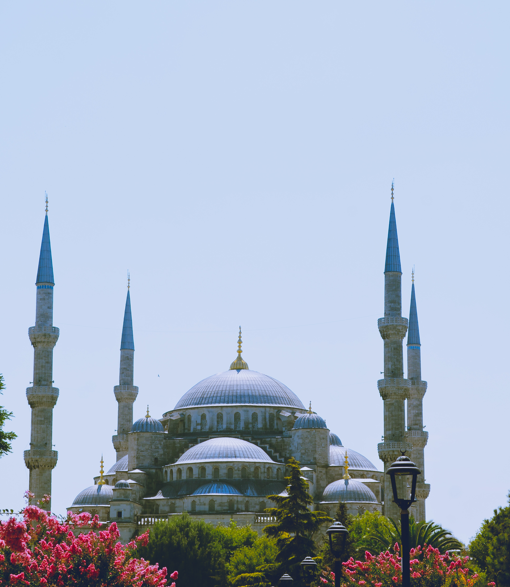
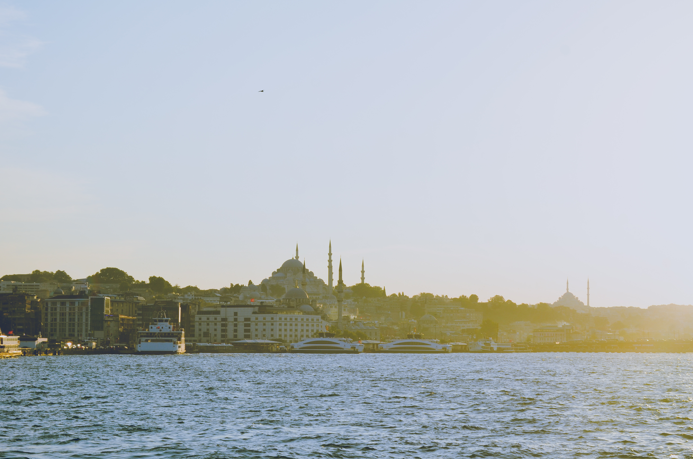

I was in Istanbul, Turkey for a short two days, but I was still able to see a lot of the European side of the city, which was pretty sweet. Here's a short and sweet article of all the best experiences I had in Istanbul!

*************************************************** 
##### **BLUE MOSQUE**

By far the prettiest mosque I've ever visited. However, in order to enter, women are required to cover up their hair, shoulders, and legs. If you aren't following the dress code, then skirts and scarves will be given to you. 




****************************************************
##### **HAGIA SOFIA**

Hagia Sofia was built in 537 AD, more than 1400 years ago, and was an architectural feat at the time with its massive domes. While it's original purpose was to serve as a church, it was later converted into a mosque under the Ottoman empire. For me, Hagia Sofia was a must do when visiting Istanbul. 


```grid|2|
 

```

&nbsp;

##### **BOAT RIDE IN BOSPOROUS STRAIT**

Taking a boat tour at sunset is a great way to see a lot of the main sights of Istanbul, such as the **15 July Martyrs Bridge,** **Dolmabahce Palace,** and several mosques. The temperature can get pretty cold in the evening even in the summer so I would bring a small shawl that you can also use during the day to cover your hair. 



&nbsp;

##### **GRAND BAZAAAR AND SPICE BAZAAR**

The labyrinth of shops selling all kinds of trinkets, clothes, lights, and whatever else you could possibly want.   


&nbsp;

##### **KEBAPS AND TURKISH DELIGHT**

The best thing about Istanbul is the food! The **testi kebaps** and **cig kofte** are some of the most delicious dishes in Turkey. After every meal, you'll also get the chance to have some Turkish tea. Many of the souvenir shops will also offer you tea while you browse, so there are several opportunities to try it.


Turkish deserts are even better than the meal. It was difficult not to try every Turkish delight and baklava possible since they all looked so good. Getting your hands on some ice cream might be harder than you think! 

```grid|2|
 


```
