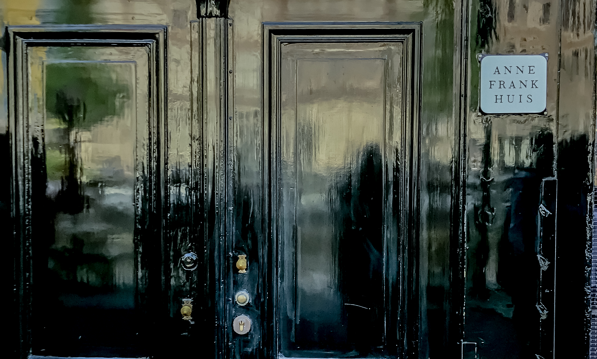

If you’re planning to visit Amsterdam, be prepared to never want to leave. While other European cities are quite impressive, the relaxing, laidback atmosphere found everywhere in the city’s buildings, cobblestone streets, and canals is hard to find in other places. The citizens can be seen socializing at quaint cafes sprinkled along every canal after a work day while others are soaking up the sun on their boats. Bicycles line every corner and actually outnumber the cars in the city. Most impressive is seeing children of all ages bicycling confidently to school behind their parents without having to fear heavy traffic. Maybe this lifestyle doesn’t seem that different for those living in Europe, but it seems so ideal for those of us from America. Particularly us who are forced to have a car to get anywhere. 


I landed on Monday afternoon, and flew out Friday noon, which gave me about four days to squeeze in everything I wanted to see. Of course, there is so much more to see in the city that I was unable to cover, but here are the main highlights, the must-dos. The saddest part of my trip was the fact I just missed the famous rows of Netherland tulips by one day when I went in May. However, the tulips and the many fond memories I have made here give me reasons to eagerly look forward to my next Amsterdam trip. 

&nbsp;

********************************************
### <center> **What to SEE & DO**

&nbsp;

##### **ANNE FRANK HAUS**



The second I knew I was going to Amsterdam, visiting the Anne Frank Haus was the first thing I planned to do. While I knew the museum was going to be a somber experience, I didn’t expect to feel as many emotions as I did walking through the house. If you have ever read Anne Frank’s diary, you will greatly appreciate this museum. Moving through the house puts into perspective how small the space that the two families were hiding in all those years ago. I thought the experience was carefully orchestrated to be informative, respectful, and thought provoking, and I really treasured my time here because of it. 

Tickets must be bought online. They become available two months in advance and sell out quickly. Plan to buy your tickets the day they get released for the date you want to go! You can still find some tickets available on the day of, but chances are less likely you will get the number of tickets or times you want.  There is no photography allowed inside to respect other visitor’s museum experience and the artifacts. 

**Tickets|** 10 Euros/Adult & 5 Euros/Child   
**Times|** 9 AM – 7 PM most days, check calendar if later openings 

&nbsp;

##### **I AMSTERDAM SIGN**


You can’t visit Amsterdam for the first time without the classic picture at the I Amsterdam sign. If you don’t want too many people in your picture, I would suggest arriving early, taking some photos, and enjoying the rest of the day close by at the **Museumplein and Vondelpark**. 

&nbsp;

##### **VAN GOGH MUSEUM**

Vincent Van Gogh is a world-renowned artist in the present day, even though he died thinking his paintings would be forgotten. I was really looking forward to the museum showcasing his talent with the largest collection of Van Gogh’s art. This museum also does a wonderful job at explaining Vincent Van Gogh and his life experiences to pay homage to his talent.  

**Tickets|** 18 Euros/Adult or FREE with City Card  
**Times|** Mon – Thurs, Sun 9 AM – 7 PM; Fri, Sat 9 AM – 9 PM

&nbsp;

##### **RIJKSMUSEUM** 


The Rijksmuseum is the national museum of Amsterdam celebrating the rich art and history of this small but significant country. The museum hosts the artwork from famous artists like Rembrandt and Vermeer that are worth checking out. The best-known painting is **The Night Watch by Rembrandt**; don’t miss it!

**Tickets|** 17.5 Euros/Adult or FREE with City Card  
**Times|** Mon-Sun 9 AM – 5 PM

&nbsp;

##### **DAM SQUARE** 


As you walk into Dam Square, the **Royal Palace of Amsterdam** is on display. On this perfect summer day, there were lots of people socializing and enjoying the sun around this area. I wasn’t able to squeeze in a visit to see the interior of the palace during my short stay, and I wasn’t too upset about that. The most impressive part was the exterior standing tall over Dam Square anyways. There were a lot of souvenir stores around here since it is a touristy spot if you want to do a little shopping. 

&nbsp;

##### **OUDE KERK**


I wandered into the **Red Light District** during the day to see the oldest building in Amsterdam. I just had to see the irony of a church standing in the middle of streets filled with temptations. The church was built in the 1500s, but it continues to leave a large influence by being one of the biggest art commissioners in the country. A modern art exhibit is unexpectedly housed in this church, juxtaposing old with new. Kind of like what’s going on outside with the church standing in the Red Light District. Check it out! 

**Tickets|** 10 Euros/Adult or FREE with City Card   
**Times|** Mon – Sat, 10 AM – 6 PM; Sunday 1 – 5:30 PM

&nbsp;

##### **BLOEMENMARKT**


```grid|2|


```

It’s the world’s largest and only floating flower market! The local’s love of tulips and other flowers is on serious display here. Even when it is not tulip season, there are roses, ferns, and all other sorts of plants to buy. Photography inside the shops is not allowed (I may have sneaked a few), but you can take as many as you want from outside. 

**Times|** Mon - Sat 9 AM - 5:30 PM, Sun 11:30 AM - 5:30 PM

&nbsp;

##### **JORDAAN DISTRICT**


One of the more upscale neighborhoods of Amsterdam, the Jordaan district puts the canals on spotlight. If you want, this would be a wonderful place to hop on a bike and explore the district like a local. Also a great place to find good restaurants and cafes. Here are some recommended options below.
- La Olivia
- Toscanini
- Cafe de Prins  

&nbsp;

##### **CANAL TOUR**


Simply the best way to see the city and get a brief introduction and history of all the hotspots of Amsterdam. I did this last on my tour, but it might be smarter to do it on your first day to get oriented to the city better. The tour company I chose was **Blue Boat Company** leaving from a point close to the Hard Rock Café. 

**Tickets|** 16 Euros/Adult, 7.5 Euros/Child  
**Location|** Stadhouderskade 501, 1071 ZD Amsterdam, Netherlands  
**Times|** 75-minute cruise, Leaves every 30 minutes from 10 AM – 6 PM

&nbsp;

****************************************************
### <center> **Where to EAT**

&nbsp;

The one thing you have to try is a Dutch specialty, a **STROOPWAFEL**. My sweet tooth was incredibly satisfied with the thin wafer sandwich with caramel like you can’t imagine. I bought a bunch at the local grocery store near my hotel to snack on throughout the trip, especially with coffee in the morning. You can also find them in almost every café. 

 

##### **Pancake Bakery** 

Located close to the Anne Frank Haus, we stopped by to grab some lunch only to be turned away due to the high number of customers there already. Instead, we made a reservation to come back the next day. Totally worth it. They make both sweet and savory pancakes of all sorts for you to enjoy.

**Address|** Prinsengracht 191, 1015 DS Amsterdam, Netherlands
    
##### **Moeders Restaurant**

This was a really good restaurant with Dutch recipes to try! 

**Address|** Singel, 1012 DH Amsterdam, Netherlands
    
##### **Café MADS**

This café was located close to our hotel and was a great place to eat dinner when we arrived. 

**Address|** Zoutkeetsplein 1h, 1013 LD Amsterdam, Netherlands
    
##### **Ice Bakery by Nutella** 

If you love all things chocolate, then this one’s for you. 

**Address|** mg, Nieuwendijk 175, 1012 MG Amsterdam, Netherlands

&nbsp;

***************************************************** 
### <center> **Where to STAY**

&nbsp;

##### **Yays Concierged Boutique Hotel** 

I stayed in this adorable two-story apartment with a full kitchen right on the canal, located in the Zootkeetsgracht neighborhood. While the location was a little further from some of the main attractions, the chance to live more like a local was too good to pass up. Also, a nearby bus stop was enough to get places without having to spend more.  In the evenings, they even gave us a bicycle to borrow and take around the street. Yays have several locations around the city if you want to stay closer to a certain attraction.

 

&nbsp;

****************************************************
### <center> **DAY TRIPS**

&nbsp;

##### **BRUSSELS, BELGIUM**

We thought about doing this if we had just one more day (isn’t that always the case) and knocking off another country on our long, long list. Except, we enjoyed Amsterdam too much to want to leave. Take a train from Centraal Station; they run pretty much all hours of the day. A quick 2-3 hours later, you are in Brussels admiring the famous **Mannekan Pis**. 

&nbsp;

##### **ZAANSE SCHANS**


```grid|2|


```

There are several places to visit in Amsterdam to see the iconic windmills. We picked to go to Zaanse, a small touristy village with five working windmills highlighting the simpler way of life in the 17th and 18th century. There are loads of cool shops, some of my favorite being the clog shop to watch how they make those wooden shoes, cheese shop to try many samples, and a chocolate shop. You can also enter the windmills for a small fee to see how they work at making dyes, flour, oil, and more!

A local train from **Amsterdam Centraal** will take you the station **Zaandijk-Zaanse Schans** in 17 minutes, from which you walk 15 minutes to reach the town. There are tickets associated with each of the museums and windmills to enter if you want to pick and choose. The Amsterdam City Card does give you free admission to some of the sights.

&nbsp;

##### **THE KEUKENHOF**

Located only 30 minutes from Amsterdam is the best gardens to see the tulips. The park is only open during a certain time of year, tulip season. From mid-March to late May, the Keukenhof sees millions of visitors who have come for the millions of tulips planted on the land. If you are in town during this time of year, I would highly suggest visiting. There are also several other locations around here to see the rows of tulips while bicycling.   

&nbsp;

### <center>**TIPS & TRICKS**

- There are coffeeshops, and there are cafes. They are two different things entirely. If you only want coffee, go to a café because it’s not all you’ll find any in a coffeeshop. 

- The I Amsterdam City Card is a really good deal for tourists with free entrance to many of the museums, free public transportation within the city, and lots of other discounts. 

