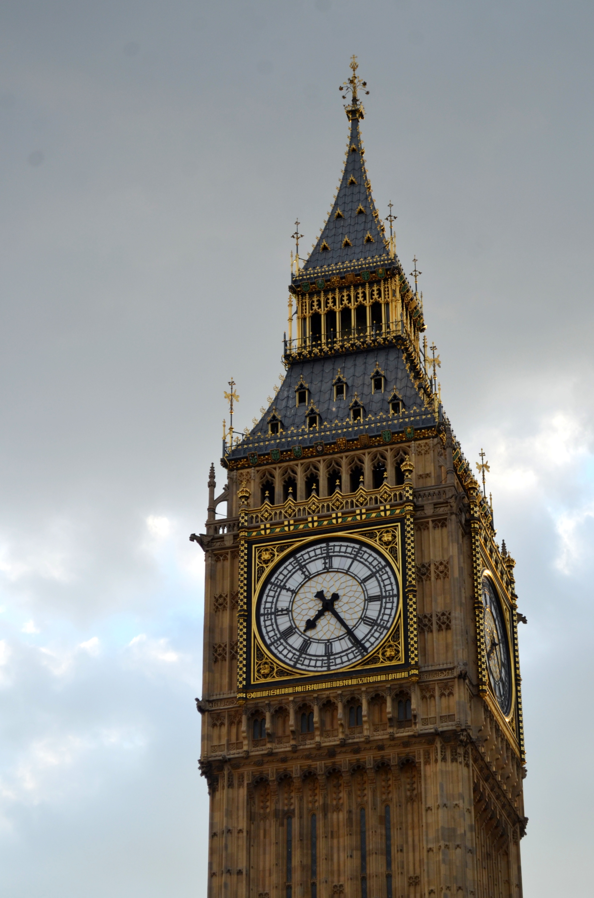

After getting over the fact I was actually going to LONDON, I planned for long days of exploring as much as possible in the 4 days (more like 3 and a half days) I was there. If there's one thing to be prepared for when visiting London in August is the loads of tourists you will see everywhere. It's time to embrace the most touristy version of you possible because there's a lot of sites in London to ooh and ahh over. 

&nbsp;

************************************************
###**DAY 1: Settling In**


#### **Find your way to the hotel from Heathrow Airport**

Figuring out transportation to your hotel and throughout your trip is important before arriving to London. I suggest getting the **Oyster card** and taking advantage of the extensive metro and bus system that ties the whole city together. Visit https://tfl.gov.uk/maps for planning your route to the hotel and to get from place to place during your trip.

#### **First Glimpse at Trafalgar Square**

Stretch out your legs at Trafalgar Square after that long flight if you flew from the US like me. Just sitting in the square is a great place for people watching, and there are several restaurants to visit for dinner nearby.

#### **Sunset on the London Eye**


Walking from Trafalgar Square to the London eye takes about 20-30 minutes. On the way you can stop to see the Thames River while walking across the bridge towards the Eye. We ran into some street performers with a large crowd gathered around them to watch them pull off some crazy stunts before our specified time for the ride. We bought our tickets online to get a discount and make sure we got the specific time we wanted. Up high, you get a fantastic view of London from the **Houses of Parliament** to the **Shard**, especially with the cotton candy pink and blue sunset.

**Visit|** https://www.londoneye.com/ </br>
**Tickets|** approx. 25 euros or more depending on which deal you choose

&nbsp;

*********************************************************
##**DAY 2: Day Trip**

I normally don't like to book day trips with a tour guide in a bus, but it seemed like the best option for seeing the most in our one day out of the city. I loved our tour guide. She kept using the word "lovely" just like a true Brit. The bus was comfortable, and the right amount of time was allotted at each of these places. 

#### **Strolling around Windsor**


#### **Stonehenge**

```grid|2|


```

Definitely a bucket list item for me to visit Stonehenge. The story behind these giant rocks is a fascinating mystery, and the location for one of my favorite episodes on Doctor Who.

#### **Oxford**


Oxford is known as the city of dreaming spires where all the architecture seems to have you always looking up at the spires trying to reach the sky. There are several important Harry Potter filming sites in Oxford such as the Great Hall and the infirmary if you're interested in seeing them.

&nbsp;

**********************************************************
##**DAY 3: Heart of London**

We bought a ticket for the Hop On Hop Off Red bus to have easy access to all the major spots of London. The constant commentary you can listen to with your headphones was great for learning about the sites as well. Today's the day to see all the main spots of London and fulfill your tourist London goals.

#### **Changing of the Guard at Buckingham Palace**


The changing of the guard is one of the most anticipated events people come to London to see. And there's a lot of people who come. I was only able to witness part of it because it's hard to find an unobstructed view the entire time. 

#### **Westminster Abbey**


I could not believe I was visiting the church that Kate Middleton got married in! Or where Isaac Newton and Charles Darwin are buried in. The abbey is incredibly beautiful at all times of the day.  

**Tickets|** </br>
**Times|**

#### **Big Ben Clock**


Classic London must-see. It's attached to the Houses of Parliament, so it's easy to visit both. 

#### **Tower of London**


**Tickets|** </br>
**Times|**

#### **Tower Bridge**


The Tower Bridge is quite often mistaken to be the London bridge referred to in the song "London Bridge is Falling Down" but its not. The London bridge is actually not as impressive as the Tower Bridge, which was even used for hanging the five ring symbol of the Olympics when it was held in London.

I took the tour of the Tower Bridge and got to look down a glass window standing over the Thames River. 

**Tickets|** </br>
**Times|**

#### **Harrods**

A visit to London is not complete without entering the esteemed Harrods. It's one of the best known department store in the world. Each floor has a certain product its centered around but the sweets floor is by far my favorite. 


#### **Piccadilly Circus**


Finally, we ended the day in Picadilly Circus which is kind of like Time Square in New York with the large LED billboards. It's so busy! This area was a good place to grab some dinner at a Thai restaurant nearby and had several subway stations to take advantage of to get back to our hotel. 

&nbsp;

*****************************************************************************
##**DAY 4: Everything Else** 

#### **King's Cross Station** 

Huge Harry Potter nerd here! I had to go to King's Cross Station to see the trolley half sticking out of the wall for a picture since it was really the only Harry Potter thing I planned for in my trip. There's usually a line of people, but once its your turn, you get the choice to pick a scarf from one of the four houses to wear. The station itself was also really cool to see since train stations are nonexistent in Texas.

#### **Madame Tussaud's**

I enjoyed Madame Tussaud's, posing with all the famous actors, singers, athletes, and more, but kind of wished I spent my time exploring some place that was more native to London. The popularity of the wax museums has caused them to spring up everywhere, and I would recommend visiting elsewhere if you have limited time in London.

**Tickets|** </br>
**Times|**

#### **Natural History Museum** 


There are so many great museums to visit in London, that it can be hard to pick. However, if there is only one museum you can visit, I highly recommend visiting the Natural History Museum. It's exactly the kind of old, historic, antique building decor and design that makes you feel like you're in class at Hogwarts. 

**Tickets|** </br>
**Times|**

#### **National Gallery**


**Tickets|** </br>
**Times|**


