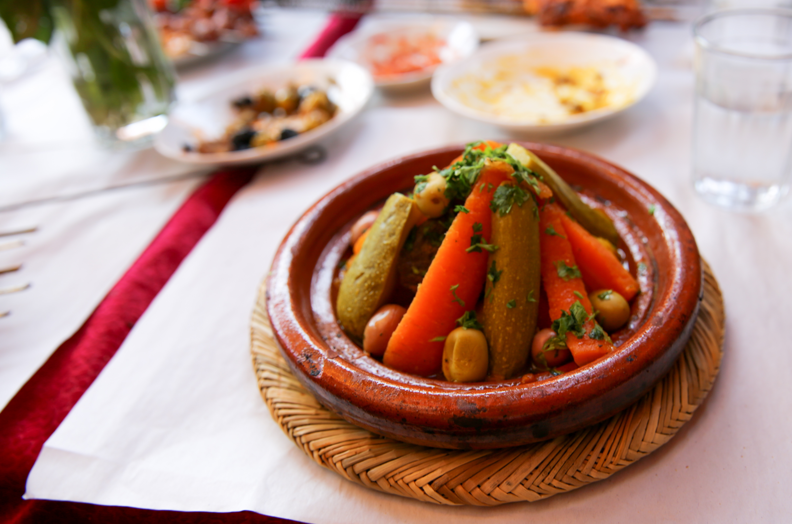
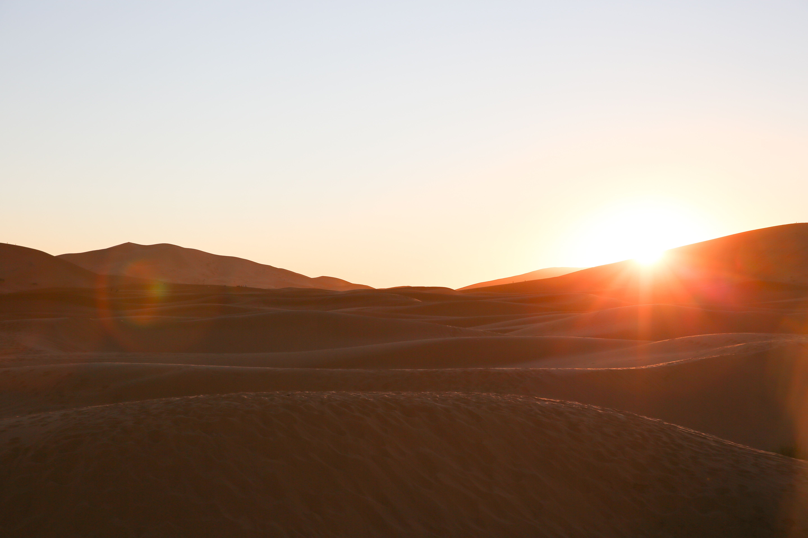
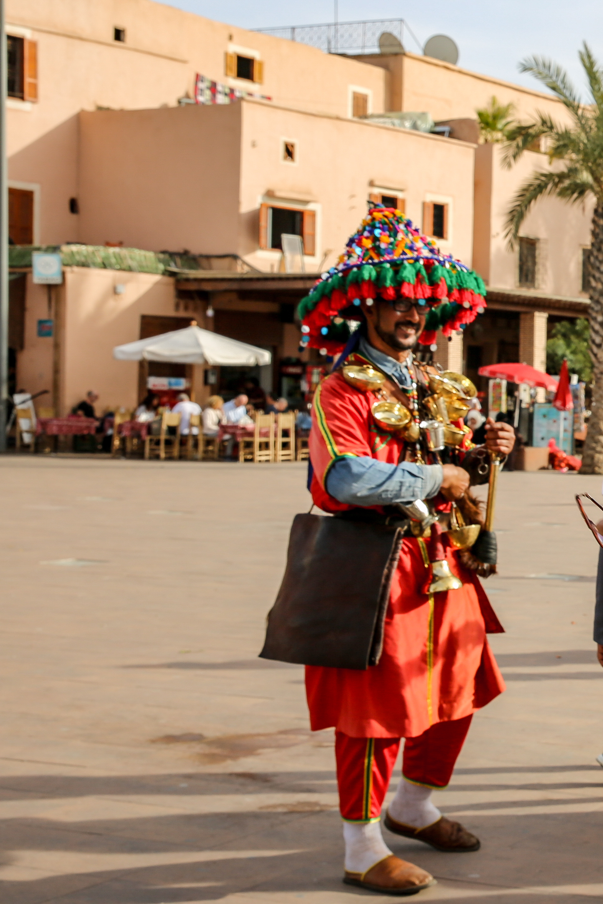

## **1 - “One thing leads to another.”**

I was told this quote by a tourist couple I met while camping in the Sahara desert, and it made me laugh at how accurate it was. This sentence can seem relevant in many situations you might find yourself in while visiting Morocco. You will notice right away that people will be coming up to you constantly trying to sell you their merchandise, a hammam, to eat at their restaurant, etc. Even if you say "No thank you," expect that the conversation has not ended for the other individual. They will continue to try to sell to you, so don't be afraid to firmly say no and walk away. If you say yes, I 

 

## **2 - Never accept the first price**

Haggling is expected when shopping in the souks. Don't be afraid to walk away if the price is not what you wanted. Usually, they will call you back to sell it for the price you had asked for. If not, don't worry! There are several shops selling similar if not the same items. If you're wondering whats a good price to ask for, I would try to start from half to a little more than half of what the shopowner is asking for. You might end up with a price somewhere in the middle. 

## **3 - Establish a budget before going – Morocco is primarily a CASH-only country**

This is quite important to keep in mind since ATM machines are not available everywhere especially on route to the Sahara Desert. You can also save yourself the grief of transaction costs with every withdrawal. If the riads or hotels you are staying at are not paid for before you arrive, you might have to pay for them too in cash. On the other hand, try to keep from drawing too much money because you are not able to exchange the currency once you leave the country. 

## **4 - Keep change on you at all times**

You are expected to tip everyone who offers help to you. This includes someone who helps you flag down a taxi, someone who tells you directions or any piece of information, and someone who helps you with your luggage to the riad. If you don't want to find yourself in the awkward position of telling someone you don't have any change or to avoid giving away larger bills, try to exchange 200 to 300 dirhams into coins at the beginning of your trip.

 

## **5 - Local food is much more affordable**

A restaurant catered towards tourist may charge upward of 100 MAD for a three course meal and bread which seems reasonable, but going to a more local place might only cost you 20-30 MAD for the same amount of food. If you’re trying to visit Morocco with a low budget, this would be a great way to cut down cost. Just be careful and avoid drinking local water that has not been boiled. 

## **6 - Trains > Taxis**

If you are traveling between cities without a rental car or a driver, consider taking a train over a ridiculously expensive taxi. For example, a grand taxi between Meknes and Casablanca might cost you 2000 MAD but a train ticket for one is 120 MAD. Between Meknes and Fez, the train is only 30 MAD! See the difference? The trains are comfortable, safe, and clean, but you should buy food beforehand if you are traveling for a few hours. You don’t get anything more than snacks and drinks on the train.

 

## **7 - Driving to the Sahara on your own is not as hard as you might think**

I was hesitant about driving a car in Morocco since this is the first time we've been to the country. My family and I went with a tour guide from Amazing Sahara Tours instead which was a great experience. However, the tour meant that we had predetermined stops that every single tourist bus, car, taxi, van stops at. While the tourist stops provided amazing vistas, there were many spots that we had to settle to see through the window of a moving car because extra stops were not too welcomed by our tour guide. Looking back, the roads were great, the traffic was minimal, and the directions were really straightforward, so it's really feasible to plan a road trip on your own. 

## **8 - Don’t always believe it when he says he’s a “government official guide”**

We're laughing about it now, but we unfortunately fell for this scheme by following a "guide" in Marrakesh. Instead of telling us any Marrakesh history as promised, we were taken to a Berber carpet shop and a pharmacy selling argan oil to be wooed/guilt tripped into buying something. When we had finally pulled ourself away from buying anything, the guide had abandoned us in a random alley. Luckily, we were close by to the main square, Jemaa al Fna, to find our way. 

## **9 - Navigating the medina is possible without a guide**

You will get lost, but isn’t that part of the adventure? I came across buildings that I wasn’t expecting to visit that made exploring the medina in Fes that much more fun and rewarding. However, to become unlost, I found any of the maps on your phone were useful to help navigate your way around or ask one of the locals. Be wary of locals who seem very eager to help you because they might actually be leading you to a store or might want some money from you at the end. In Marrakesh, the narrow streets are used by people, motorcycles, bikes, cats, and many more. Being alert while exploring will be important. 

I wanted to include this tip because we were told by multiple staff members at our riad that we would definitely need a guide to get anywhere. However, this is simply not true. If you do want a guide, I would advice booking your own guide with a company you trust and have done research for before your trip to avoid paying higher prices by booking through the riad or getting a guide that might be scamming you. 

## **10 - Have your passports handy when you arrive at a riad**

You have to stay in a riad during your time in Morocco. It's a completely different experience from staying in a hotel, and you really see the hospitality of the Moroccan people. When you arrive at your riad, they will need to see your passports and you will need to fill out a form for every member in your party. This is a government requirement no matter where you go. For me, this was something I never had to do before and didn't read about it anywhere before I arrived. 

## **11 - Don't take photographs of the locals or their shops unless they say it is okay.**

This is a pretty important point to keep in mind as you photograph your visit to Morocco. If you don't want someone to start yelling or shake their fist at you for taking a photograph of them or their store, just be polite and ask. Most of them are willing to let since tourists interested in their stuff is good for business. Others might have signs up asking you to not take any photos. 