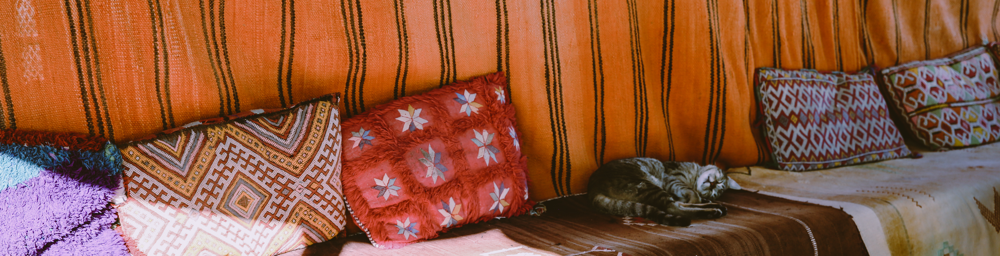
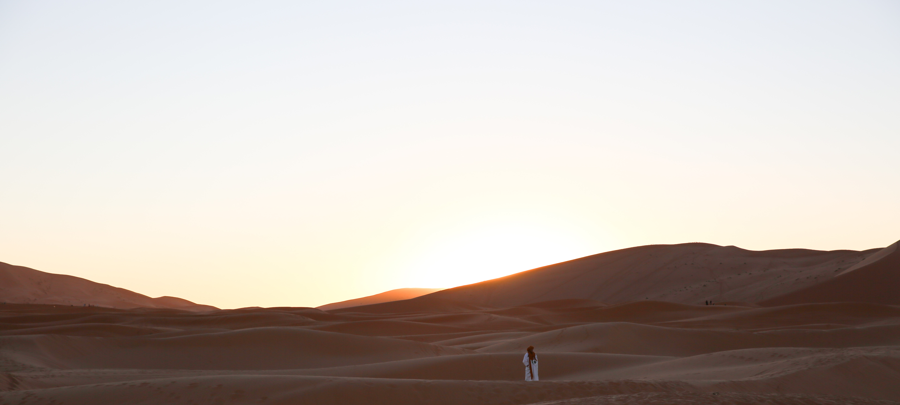

The roadtrip to the Sahara was a bucket list experience I was excited to do. Camping in the Sahara was quite unlike anything I've done before, and I got to see a lot of Morrocco from the most touristy of places, such as Ait Ben Haddou, to more real life Moroccan villages during the drive. We passed through a variety of environments from snowy mountains to towering sand dunes. While the drive to the desert took almost two days from Marrakesh to get there, the many small stops we made made the time move by fast. After spending our night in the Sahara, we were in Fes by the end of the day after 10 hours of driving. While the four day tour is more popular, we were interested in spending less of our days in travel if possible. To the best of my knowledge, the stops we missed were seeing the wild monkeys and a waterfall, which we were okay with.

 

&nbsp;
&nbsp;
*********************************************

### **Places We Visited on the Way**

&nbsp;

##### **Atlas Mountains**

```grid|2|
 


```

Col du Tichka is the highest point of the Atlas Mountain that we passed by during our trip. There's not much to see here, but it marks the beginning the road to the Sahara. 

##### **Ait ben Haddou**

 

```grid|2|
 


```

Our first stop after leaving Marrakesh at 8 AM was for lunch and a quick stop at Ait Ben Haddou. It's the oldest kasbah in Morocco and served as a trading post and safe place to spend the night for traveling caravans in the past. Now, it is a UNESCO World Heritage site where several famous films have been shot. As you make your way up to the top of the mountain, there are lots of vendors trying to sell souvenirs. Once walking past all these shops and admiring the wares, you're at the top of the city to see the fortified granary. 

##### **Dades Gorge**

 

We spent the night at a hotel in the Dades Gorge and got to see the gorgeous view in the morning. As we drove out of this area towards the Sahara, we passed by some interesting rock formations called "monkey fingers." 

##### **Todra Gorge**

 

 

The Todra Gorge is a short stop lots of tourists make on the way to Merzouga. The gorge was very windy and cold that it felt like we were finally seeing some winter in Morocco. While we walked around, we saw many Bedouin people either selling their wares or asking for money to take photos with or of them. However, my favorite was seeing the donkeys drinking from the fresh stream passing through the gorge. I had seen many times during my drive through several towns that primarily donkeys were used for carrying huge loads. Our driver told us that the weight placed on their backs was sometimes even 4 times their own weight. So impressive for such a small gentle looking animal. 

##### **Ancient Waterways - Qanats**

 

 

Visiting the qanats was one of the more educational stops we made. It's a sloping underground channel that directs the water to the top to water the palm trees that used to grow in the area, and it's approximately 40 miles long. Qanat means channel, and the profession to build the qanats was a highly regarded job that was passed from father to son. We even got to climb down into the channel to see how wide the actual tunnel was for a small tip. 

I also just had to include the cute picture of the sleeping cat we saw after coming out from the qanat. 

&nbsp;
&nbsp;

**********************************************

### **Camping in the Sahara**

All I could think of seeing the Sahara desert was how vast it was. We drove on an off road to the Sahara that was bumpy but exciting while we raced with other SUVs. When we got out of the car after coming second in the race, we gave our luggage to staff to drive it to our campsite during our camel ride. I did not know what to expect for the camel ride, but I was looking forward to it. The camels seemed to be properly cared for and healthy, and they get to live a comfortable life nearby. Getting onto the camel wasn't too difficult but sitting on him/her while they stood up definitely required holding onto the handle to not fall off. During the ride, I had to move my hips to really get into the groove of camel's stride to feel comfortable, but overall, it wasn't too difficult. The camels dropped us off at a convenient location to watch the red sun set behind the tall orange sand dunes before heading to our camp. 

```grid|2|
 


```

 

If you think you're going to be prepared for the night, think again. There were so many aspects of my night in the Sahara that left me unexpectedly amazed but also wishing I had been more prepared. To me, seeing the millions of stars and being able to faintly make out the Milky way in the night sky was incredible and stole the spotlight.

After dinner with our fellow campers, we all spent quite a while standing together in awe of the sight of the night sky. Then, the campsite had arranged night of listening to Berber men play the drums and sing local songs around a warm campfire which felt like a truely unique Moroccan memory. Spending the night in a tent with no heater in the Sahara desert in December was an experience to say the least. BE PREPARED and pack lots of warm layers to sleep in. The campsite also provided four thick blankets to sleep with. I pretty much felt like a sardine packed under all those heavy blankets and warm clothes, and I found it hard to fall asleep being stuck in one position under the weight of it all. And somehow I was still cold. Whatever you think you might need to stay warm, double it. 

The campsite I stayed in had a working toilet and plenty of toilet paper, so bringing toilet paper was not necessary. However, other campsites might be different. There was also a shower, but the water was freezing cold. I also had access to one working outlet, but I still recommend bringing a power bank to use. 

Sunrise in the winter was at 8:15 AM. Even though I did have an alarm to wake up on time, the braying of the camels woke me up too. If you want to have an awesome experience on top of a tall sand dune with an unfettered view of the desert and the sunrise, the hike will take about 45 minutes if your campsite is near the edge. Don't forget to take some water! Dunes we had passed by the evening before didn't have the footprints of camels and people anymore but tiny tracks of all sorts of creatures that must have come out at night or early morning. 
 
 

 

Arriving back at the camp, there was a hot delicious breakfast with a full spread of crepes, eggs, fruit, and coffee! Honestly, the food we had for both dinner and breakfast was some of the best we had all trip, so we were really appreciative of the help working at our campsite. After getting back onto our new camel friends who had spent the night outside our tents, we headed back to the car to meet our driver by 10 AM to go to Fes. 

No matter what, making the trip out to the Sahara while visiting Morocco is a definite must whether doing a self road trip or one of the many organized tours. 