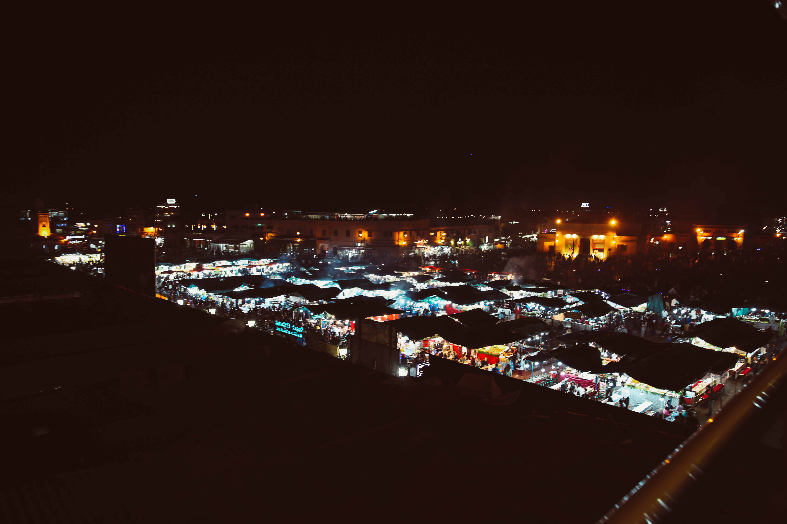
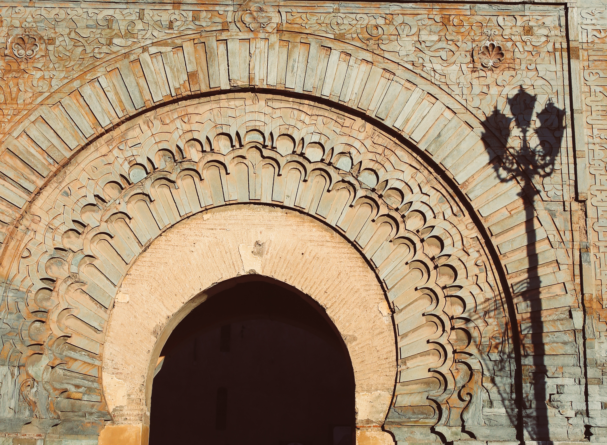

Welcome to Marrakesh, the city of red. It's called the Red City because of the color of the clay buildings, but really what made it unique for me from the other cities were the narrow and busy medinas, tall minarets, and beautiful riads. Here's how I spent my two days in Marrakesh before leaving for the Sahara. 

 

&nbsp;

*****************************************************************************
### **Day 1** 

#### **Moulay al Yazid Mosque**


#### **Koutoubia Mosque**

#### **Souks**


#### **Jemaa al Fnaa**




*****************************************************************************
### **Day 2**

#### **Red Gate**



#### **Jardin Majorelle**

```grid|2|
 
 
```

#### **Bahia Palace**


#### **Saadian Tombs**


#### **Mamounia Hotel**


