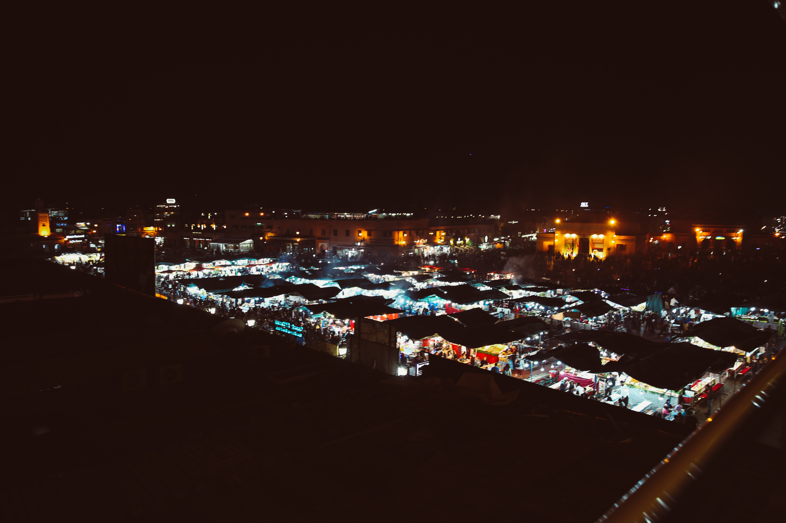

I was so excited to finally visit my first African country. Morocco is a great place for an introduction to Africa since it is primarily a tourism centered country. The cities are all so unique from any place I've been before with lots of interesting history. I was able to visit four of the major cities in Morocco during my 8 days and learned lots of interesting lessons as a tourist in Morocco. 

**Read More|** [Lessons Learned in Morocco](/blog/lessons-learned-in-morocco)

Sadly, a few days before we had arrived to Morocco, two women hiking in the Atlas mountains had been murdered by some remote villagers, which was disturbing to hear. It made us a little nervous to visit. However, the locals made sure to show tourists that this incidence was not condoned at all by Moroccans. A vigil was held for the two girls while we were around Jemaa al Fnaa. While we had a great experience spending a week in Morocco, I would still exercise caution if traveling on your own without a guide. While the major cities of Morocco are tolerant of Western culture, there are small pockets of Morocco may not be as accomodating. 


&nbsp;

*****************************************************************************
### **Marrakesh** 

Welcome to Marrakesh, the city of red. It's called the Red City because of the color of the clay buildings, but really what made it unique for me from the other cities were the narrow and busy medinas, tall minarets, and beautiful riads. Fun fact: none of the buildings in Marrakesh can be taller than the minaret at the  main mosque, Koutoubia mosque. Here's how I spent my two days in Marrakesh before leaving for the Sahara.

**Read More|** [Roadtrip to the Sahara Desert](/blog/roadtrip-to-the-sahara-desert) 

&nbsp;

#### **Must See:** Moulay al Yazid Mosque, Koutoubia Mosque, Bab Agnou, Jemaa al Fnaa & souks, Bahia Palace,  Jardin Majorelle


The **Saadian tombs** are next to the **Moulay al Yazid Mosque** if you're interested in visiting. I found the minaret of this mosque to be more beautiful than the Koutoubia Mosque. The well-known **Koutoubia Mosque** is a short 10 minute walk from the Moulay al Yazid mosque. On the way, we got some freshly squeezed pomagranate juice and sugar cane with ginger and lemon juice. So good and only for 20 Dirhams each. 


After our trip to Morocco, we watched The Mummy since it was filmed in Morocco, and the only sight we were able to recognize was the distinctive **Bab Agnou**, translating to Red Gate. There are several other gates throughout old city of Marrakesh but Bab Agnou is the most famous. 


```grid|2|
 
 
```

There are several great restaurants in **Jemaa al Fnaa** to eat dinner at and get a good bird's eye view of the square. Walking through the square, the atmosphere is very lively and busy. Lots of stalls are set up in the evening selling dinner, fruit juice, mint, etc., and the smell of food and herbs fill the air. Some of the more unfortunate aspects of the square is seeing people with monkeys on leashes or in cages. I highly recommend not encouraging this behavior and avoiding these individuals. 


Bahia Palace was built in the 19th century and has more of the classic colorful architecture that Morocco is known for. As you walk through the different spaces of the palace, there are different types of design to admire. 


```grid|2|
 
 
```
The last stop was at the brilliant blue and yellow Jardin Majorelle where the famous YSL used to stay in after falling in love with Morocco. It gets really busy to the point there was already a long line early in the morning to enter, so I would recommend making this your first stop of the day. 

&nbsp;

#### **Where to Stay**

We stayed at a beautiful, homey riad called **Riad Les Bougainvilleas**. We had a two bedroom place next to the pool and well decorated. The location was convenient for visiting the different sites around Marrakesh. A full breakfast with crepes, bread, fresh orange juice and more is offered at most riads, so let your host know the night before that you want breakfast prepared the next morning. 

If you have a room in your budget to stay at a 5 star hotel in Marrakesh, I recommend the popular hotel, La Mamounia, which has great picture spots for a small photoshoot and a great location close to the medina. 

&nbsp;

*****************************************************************************
### **Fes**

Fes was by far my favorite city in Morocco. Somehow, the souks were even more narrow than in Marrakesh, but that much more interesting. We kept finding little historical places that we didn't plan on seeing. Once we entered through the famous Blue Gate of Fes (Bab Bou Jeloud), there were all kinds of shops as far as the eye could see. As the souks slope downwards, you are heading deeper into the labyrinth. 

&nbsp;

#### **Must See:** Blue Gate, Seven Golden Doors, Souks, Chouara Tannery, Bou Inania Madrassa, Al Attarine Madrassa


```grid|2|
 
 
```
The seven golden gates are the only view you can get of the palace that the Moroccan king uses when in Fes. It's probably the most glamorous spot in Fes that lots of visitors come to see. 

Soon after entering the souks of Fes, the crowds of people and stores become more concentrated. There are several interesting sites to see in between the stalls. Unfortunately, **Al Attarine Madrassa**, which has the oldest library in the world, was under construction when we visited and was only open for students of the university. However, **Bou Inania Madrassaa** was open to visit for tourists and the intricacy of the architecture was provided a small taste of the beautiful design of one of the oldest universities in the world to enjoy. 

 

Finding the famous **Chaoura tannery** built in the 14th century is a bit difficult to navigate to from the middle of the souks. Fortunately, we ran into a young boy who seemed trustworthy enough to take us to the tannery and show us a good place to grab lunch after. There are several leather shops that offer a view to the tannery, and all will offer a sprig of mint to combat the strong smell of ammonia. It took us under an hour to visit all three balconies. The smell wasn't too bad but maybe it's because I've been in an anatomy lab with 36 bodies preserved in some strong smelling formaldehyde, but I digress. One area is dedicated to stripping the lamb skin of the fat and hair, and the second area is dedicated to staining the leather after its done drying. When you are ready to leave the balcony, you might be asked several times to buy some leather products or provide a tip for getting a spot on the balcony. 

 

#### **Where to Stay**

When we arrived in Fes from a night in the Sahara, we stayed at **Riad Yasmin** which had really good service and extremely overly decorated rooms. To be totally transparent, we did not spend much time in the riad to relax and only came back to sleep at night. Also, just two streets down was a convenient spot to find taxis.

&nbsp;

******************************************************************************
### **Meknes**

Meknes is not a city most people visit, but I would argue that it was the most authentic Moroccan city we visited. The souks were selling more local necessities of cooking ware, undergarnments, and children's toys than tourist souvenirs. From Meknes, you can also find a taxi to Volubilis from Bab Mansour.

**Read More|** [Volubilis: Roman Ruins in Morocco](/volubilis-roman-ruins-in-morocco)

&nbsp;

#### **Must See:** Bab Mansour "Prettiest Gate of Africa" 

```grid|2|
 
 
```

******************************************************************************
### **Casablanca**

Casablanca is more of a metropolitan city that doesn't have the same historic vibe of Marrakesh, so it was quite different than the rest of Morrocco. Since most international flights are from Casablanca, it is easy to plan to explore Casablanca for a few hours before flying out. 

#### **What to See:** Hassan II Mosque

The **Hassan II mosque** is the largest mosque in Africa and the fifth largest in the world. Ending our trip to Morocco at the mosque before our flight out was a great final conclusion. The large open square had children playing and couples walking around while the mosque stood peacefully behind with the sound of the Atlantic Ocean in the background. It was a calming and very spiritual experience without even entering the mosque and without even being Muslim. Attention to detail was incredible. I admired the architect for being able to create the spiritual atmosphere.

There are certain times allotted for when non-Muslims can enter the mosque, but otherwise visitors are only allowed to walk around the exterior. 

&nbsp;


```grid|2|
 
 
```

*****************************************************************************
### **How to Dress in Morocco**

The last thing you want to do while visiting a conservative country is to stick out like a sore thumb by showing too much skin. While there were some tourists that chose to dress less conservatively in Marrakesh, I did not see many throughout the rest of Morocco. 

Since I was a guest in another country and there to learn about the culture, it didn't feel appropriate to not cover up shoulders and wear shorts/dresses shorter than my knees. Most mosques do not allow non-Muslims to enter, and the ones that do did not require covering the head. 

***************************************************************************
### **What to EAT**

**Tajine** - It's most likely gonna be 75% of your meals in Morocco. Every touristy restaurant you go to will have tajine, so it might become a little repetitive towards the end of the trip. My personal favorite was the lamb tajine. The tajine is actually the name of the unique looking clay pot that the dish is cooked in over a fire, allowing for the steam to build up and cook the meat. Moroccans don't tend to cook with too many spices, so dishes might taste a little less seasoned to those like me who eat with lots of spices. 

**Chicken Bastilla** - A savory chicken pie with a flaky crust topped with white powder sugar and cinnamon. 

**Harira** - A warm comforting soup that is a delicious appetizer. 

Surprisingly, there are not many sweets in Morocco, unlike Turkey. Most meals are served in three courses with the last course usually being a plate of fruits such as bananas, apples, and oranges. It was a good break from the processed sugar sweets we're always reaching for in America. 

*********************************************************************************
That's all I've got for my trip to Morocco! Hopefully the next time I visit, I get a chance to make it to the other cities such as Rabat, Tangier, and the blue city of Chefchaouen. 