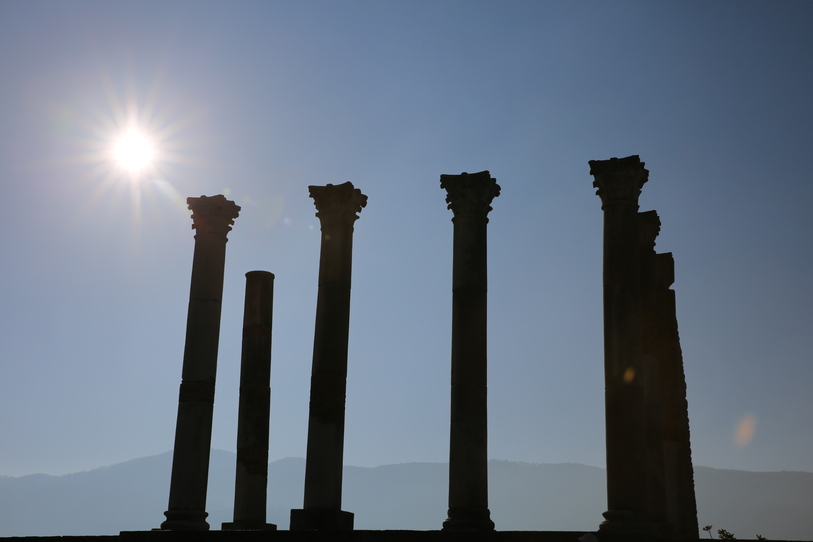

After spending a relaxing night in old city Meknes, my family and I were looking forward to seeing Volubilis. The ancient Roman ruins are still standing and show a rare glimpse of how life was back then. After a week of desert, souks, tajine, camels, and other very Moroccan experiences, Volubilis was different and relaxing to be away from the throngs of people.  

**Read More|** [Visiting Four Cities in Morocco](https://www.wheretonextdoc.com/blog/visiting-four-cities-in-morocco)

We found a taxi driver willing to take us to Volubilis at **Bab Mansour**, also known as the prettiest gate in all of Africa. We negotiated with the driver of a grand taxi to come with us and stay for an hour an half at the ruins before taking us back to Meknes for a reasonable price of **300 dirhams**. The drive from Meknes was a short 25 minutes and took us right to the entrance of Volubilis.  

**Times|** 8:30 AM until 60 minutes before dusk </br>
**Ticket|** 70 Dh


When we arrived, only a few people were trickling in. Volubilis usually does not make into many people's itinerary in Morocco since there are many other famous spots to see. The weather was beautiful as we walked through the small olive tree grove to the ruins. Olive oil and olives used to be the primary product when the city was still functioning.


The main city center used to be where the trading happened and the travelers passed through. On one of the columns, a pair of nesting storks had built an impressive nest, which we learned can hold up to 40 kg of weight. 

```grid|2|
 


```

As I strolled through the mansion ruins, there were several ceramic tile floors depicting various Roman mythology. 


