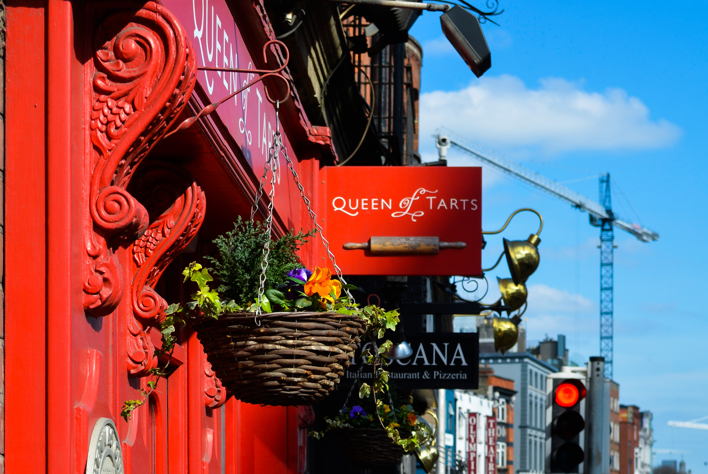
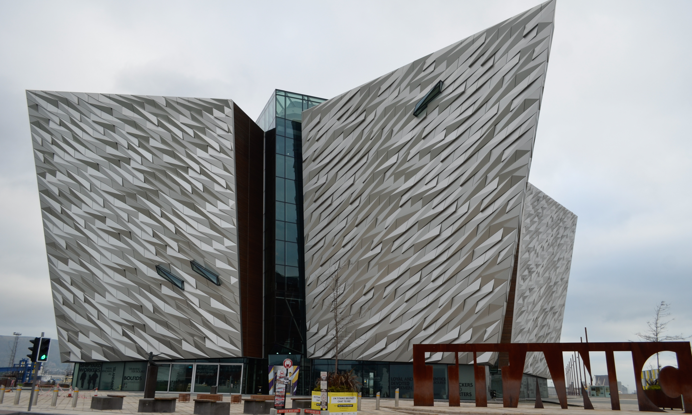

This spring break, I decided to take advantage of the inexpensive flights out of Dallas to visit the fair island of Europe, Ireland. If I had to sum up my trip in a few phrases, I would say "driving through the lush countryside and hunting for ruins to visit." To my surprise, we barely ran into large crowds of tourists throughout the entire trip and avoided the rainy weather that is so characteristic of Ireland. I'll just count it as my good luck thanks to the Celtic gods. 

My itinerary was quite ambitious and required driving to a new city every day, so it might not be for everyone. That being said, I got to see everything I prioritized during my seven day visit and more, so I'm glad we were able to drive across the country in our tiny little **Hyundai I10**. We didn't get to spend time in most of the cities other than Dublin and only got to see them in the evening when checking into the hotel and in the night when we went to some local restaurants and bars. 

We learned so much about the Irish culture of "craic" and warm hospitality and love of Guinness, but we also learned about **many useful tips that can help avoid some of the larger crowds of tourists and spend a little less on entrances by supporting locals offering passage to the same sights.** This is going to be a long post so grab a pint of Guinness and settle in. 


&nbsp;


******************************************************************

### **Day 1: Dublin**

Our flight landed at 10 AM in the morning. The first thing we did was exchange some of our currency for euros. Immediately after exiting baggage claim, we decided to buy a sim card from Vodaphone to have data for navigating on Google Maps during our trip. This was a lot cheaper option than renting a GPS for 10 euros a day from the car company since the sim card only costed us 25 euros for a 20 GB plan, 100 minutes of free calling, and free roaming in Northern Ireland. 

> The two best options for a SIM card while traveling in Ireland are Three and Vodaphone. If you need to buy in the airport, then only Vodaphone is available. However, the Three SIM card is actually cheaper, costing only 20 euros for unlimited data, and can be found in most Spar stores in the city. 

After figuring out the SIM card, we had to pick up our rental car from Sixt. Having a car in Ireland is the best way to see it, so I was really glad we had one. They will try to convince you to take a bigger car, but stick with the smaller car if possible. It's cheaper and less likely to be damaged in the narrow Irish countryside roads. They will also charge you a rental car fee if you are traveling to Northern Ireland that was around 35 euros with Sixt. 

> Buying a CDW (collision damage waiver) insurance with the rental company is required in Ireland. However, we found out that our credit card, Chase Sapphire Preferred/Reserve, can count as the primary insurance to avoid having to get the CDW. In order to claim this with the rental company, you will need to show a letter of proof from the credit card company at the rental company desk before paying.


The hotel we stayed at was called **Arlington Hotel**, located right on the Liffy River. The best part of the hotel was its location to all the important sites in Dublin that were at the most a 25 minute walk away. Most hotels in the city center like the Arlington don't have onsite parking so they will tell you to park in a car park nearby for a slightly discounted price. Since we arrived a little early around 2, we had an hour to kill before getting our room, and just dropped off our bags to roam. 

In an hour, we were able to cross **Ha'Penny Bridge** into the Temple Bar district to see the distinctive red **Temple Bar**. We then walked to see **Dublin Castle and Christchurch Cathedral**. Everything was so close to each other that having a car in Dublin would be useless.

```grid|2|
 

 
  
```

A little stop we made before heading to the Guinness Storehouse was at **Queen of Tarts,** a well known pastry shop close to Christchurch Cathedral. We ordered a Victorian sponge cake with fresh whipping cream that was just so good. 

Around 4, we left for our tour of the famous **Guinness storehouse at St. James Gate**. We were really surprised with how nice the exhibit was for stout since some science museums aren't even that nice. The museum informs you about the founder of Guinness and how Guinness is actually made. The best parts of the visit was taking part in Guinness Academy where we got to pour our own glass and then going upstairs to the bar for the 360 view of Dublin. The Guinness here was probably the best I had, and maybe that was because it had come straight from the source. 

While checking out at the Guinness Storehouse, the person working the cash register told us about the Horizon FexCo card for tourists. 

> As a tourist, we are exempt from the VAT tax on certain items such as souvenirs. This means you can get a refund for the tax you are paying if you fill out the appropriate forms and deposit them at the airport before you leave. Be sure to ask at every store if they take the Horizon FexCo card or have a tax exempt form to print out for you.  

&nbsp;


*****************************************************************************
### **Day 2: Dublin + Belfast**

The first thing on our list was visiting the famous **Book of Kells at Trinity College**. Buying tickets ahead of time online for the specific time you want to go is a good idea especially in the summer when its very busy. Even though you can only see the Book of Kells open to one page during the exhibit, the real treat is getting to the see the library that looks even more tempting to get lost in than the library in Beauty and the Beast. Towards the end of the hall, we got to see the **Brian Boru harp** which image graces every Guinness pint glass. 

```grid|2|
 
 
```

Close to Trinity College is St. Stephens Green for a nice midmorning stroll with coffee. Everyone was just enjoying the sunny day, which aren't supposed to be too often in Ireland. Normally, Ireland sees rain on atleast 200 days each year. We then walked to St. Patrick's Cathedral which was just a short 15 minute walk. If planned well, walking to all the main sights in Dublin is totally possible!  


Finally, we took the car out today for our first big drive to Belfast. We had the avoid tolls option on in Google maps for the entire trip, and we didn't really see any changes in travel times. When people tell you that it takes longer than expected to get between cities in Ireland, it's totally true. I would add 30 - 60 minutes extra time than predicted by Google. On the way, we took an exit for the **Bernish viewpoint** that gave us our first taste of the narrow roads to come. 

Even though we didn't have time to explore Belfast, we did stay in the **Titanic Hotel** right across from the Titanic museum. The Titanic actually started its journey from Belfast, and the hotel we stayed at used to be the offices of the company that designed the luxurious cruiseliner, which was really cool. 



Even though the museum was closed by the time we reached Belfast, there were still boards set up outside to read and learn more about the history of the Titanic as well as future plans about the space around the museum. The museum itself is a really interesting piece of architecture that we decided looked like a ship breaking through an iceberg. If only the actual Titanic had been able to pull that off. 


&nbsp;


****************************************************************
### **Day 3: Giant's Causeway + Galway**

Just two hours from Belfast is Giant's Causeway and several other interesting spots to visit that showcased the natural beauty and lush countryside of Northern Ireland. While I enjoyed exploring Dublin, driving through the small towns and looking at old ruins was what I had been looking forward to in the weeks before our trip. 

**Read More|** [Seeing Giant's Causeway and More in Northern Ireland](https://www.wheretonextdoc.com/blog/seeing-giants-causeway-and-more)


After spending half the day in Northern Ireland, we made our longest drive from **Dunluce Castle** to Galway, a 5 hour drive. If you have an extra day, I would highly recommend using it here to stop half way in Donegal and then spending the next day driving out to see **Downpatrick Head, Kylemore Abbey, and Connemara National Park** before reaching Galway. Just outside the city of Galway, we ran across a friary known as Claregalway Friary. We happened upon at the right time of day just as the sun was going down. It was truly magical. 


```grid|2|
 
 
```

We reached just around sunset and got the chance to see the **River Corrib**, the shortest river in Europe, and walk the famous **Quay Street** near the **Spanish Arch**. We found convenient parking at the Dock Street Parking Lot for 3 euros. At night, the streets got lively with music and college students taking advantage of the many bars. 

> If you're looking to buy a Claddaugh ring in Ireland, why not buy it on Galway where it was originally made!


&nbsp;

*********************************************************************
### **Day 4: Cliffs of Moher**

If there was one place I had flown all the way to Ireland for, it would be the Cliffs of Moher. I was quite excited for this day.  

On the way from Galway to the Cliffs of Moher, we stopped at **Dunguaire Castle** and **Corcomroe Abbey**. Unfortunately Dungauire Castle was closed to the public for a documentary filming when we arrived, but really, the impressive part of the castle was its location right on the water. Corcomroe Abbey was a little bit out of the way, but was well worth taking the time to drive out to it. When we arrived, a small group of 6 people were just leaving, so we had the abbey all to ourselves to explore. I was surprised to learn that the abbey was actually not well funded in its time, despite how impressive it was to walk through today. 


```grid|2|
 
 
```


When we arrived at the Cliffs of Moher, we chose not to park at the crowded visitor center parking lot, but opted to park at **Hags Head**. A family has converted some of their land into a small parking lot for 2 euros. This was probably the best decision we could have made because the views from Hags Head were incredible. Again, my thanks to the Celtic gods for not making it rain or be too misty on the one day I had allotted for the Cliffs of Moher. Otherwise, spending a night in Doolin might help increase your chances of seeing the cliffs in case of bad weather one day. 

```grid|2|
 
 
```


```grid|2|
 
 
```
After two hours of walking along the dramatic coast of the Cliffs of Moher, we started making our way to Dingle. On the way is one of the most famous castles people visit in Ireland called **Bunratty Castle**. We just missed the last time to make it inside, but it seemed to be one of the more intact castles that we had seen so far. 


 Once we had checked into a B&B called **Short Strand**, we decided to drive into Dingle for some dinner and bar hopping to catch some traditional Irish music. We stopped in Dick Mack's for a few minutes, but it was incredibly crowded with locals and toursits. Instead, we made our way to **Paul Geaney's** that seemed to have more locals than tourists for a pint of Guinness. 

&nbsp;

*****************************************************
### **Day 5: Dingle Peninsula**

There's always a discussion about Slea Head Drive versus the Ring of Kerry, and I'm all for Team Slea Head Drive. The smaller peninsula was a bit more isolated without the large tour buses, but still had so many scenic turnouts and interesting stops along the way. While the road was narrow, the drive was manageable with the small turnouts to move out of the way from cars. Buses are required to drive clockwsise on the Slea Head Drive so driving clockwise can also prevent having to drive against the bus traffic. 

**Read More|** [Scenic Slea Head Drive: What to See & Do](https://www.wheretonextdoc.com/blog/scenic-slea-head-drive)


&nbsp;


*******************************************************
### **Day 6: Killarney + Ring of Kerry + Cork**

Killarney was a larger town than I expected it to be, and it's actually a great place to keep as home base as you explore Ireland. Some people had mentioned the town was a little too touristy, but I didn't find this to be true at all. While we weren't able to drive the entire Ring of Kerry, we did take the time to make some of the main stops on the ROK closer to Killarney. 

We started off with visiting Ross Castle just 15 minutes from the Killarney city center. The castle has been recently restored. 


Afterwards, we went to go hike the Gap of Dunloe. Right around the famous Kate Kearney's cottage, all cars were required to park so hiking is the only way into the Gap of Dunloe. There are also horse carriages available to take you all the way to the main spot of the Gap, which is a fun way to see the scenary. We decided to hike a part of the way in since the full hike would take around an hour and a half, but we still go to see some stunning views.  


```grid|2|
 
 
```
Once we made it back, we made a spontaneous decision to drive part of the ROK to see **Ballycarbery Castle** near Cahersiveen, which unfortunately turned out to closed to the public. At least we got to drive a third of the ROK! If you've seen the movie Leap Year, then you would recognize that Ballycarbery Castle is the one the couple visits while waiting for the train, but it looks nothing like that. 


Once we had returned to Killarney, we decided to see Muckross House. However, the real highlight of the area was visiting Muckross Abbey which is free. If you want a very impressive and kind of creepy abbey to visit, definitely see Muckross Abbey. The center of the abbey had a yew tree growing that is over 500 years old. Muckross Abbey was also frequently visited by Bram Stoker, the Irish author who wrote Dracula. There's even a morbid legend about a man   . All I could think seeing the yew tree bark was that it was used in Voldemort's wand...


```grid|2|
 
 
```


With all the sightseeing over, we made our way to our fanciest hotel, the Hayfield Manor, in Cork. Since we missed out on staying in a castle, we decided to atleast stay in manor for a night. 


&nbsp;

*******************************************************
### **Day 7: Rock of Cashel**

Before leaving the region around Cork, we woke up very early to drive into Cobh to see the famous Deck of Cards. If you have an extra day, Cobh is another interesting place to visit. If you recognize the picture from Cobh, it's a classic picture that many try to get while in Cobh. The best spot to stand is at the Spyhill Street. 

Finally, we began making our way back to Dublin with a stop at the famous and stunning Rock of Cashel. 


```grid|2|
 
 
```

&nbsp;

Nearby to the Rock of Cashel is a lesser known ruin called Hore Abbey. Entrance is free but finding a good place to park can be harder. When we visited, no one else

*********************************************************
### **Day 8: Fly out of Dublin** 


