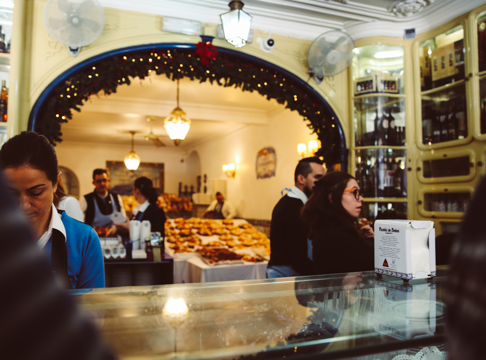

Lisbon is a beautiful European town to visit during the winter months. While the rest of Europe is experiencing the wintery cold and snow, Lisbon weather is sunny, breezy, and just perfect for exploring. Most people go to Lisbon between March to October for the warm sunny summer, but I thought visiting during December was perfect since there were fewer crowds and Christmas spirit everywhere we went. Between the colorful tiled walls and orange rooftops, the smell of salty water and fresh seafood, and the sound of musicians of all kinds wherever you go, Lisbon is simply amazing.

 

&nbsp;

**************************************************
####**What to See & Do:** Praca do Commercio, Alfama District, Jeronimos Monestery, Belem Tower

Praca do Commercio is the main center of the city, and one of the first places we saw. 

Don't eat near Praca do Commercio because I've heard that the food isn't as great and quite expensive.

 

We stumbled across the **Convento do Carmo** after seeing the Elevador de Santa Justa, and I highly recommend entering. The ceiling of the convent has fallen due to an earthquake and left a direct view out to the sky. At the time of the earthquake, it was the largest church in Lisbon. The entrance fee was only **4 euros**, and we pretty much had the whole place for ourselves. 

 

If you ever come across a sign pointing towards a Miradouro in the **Alfama district**, take the time to follow it. The path usually will lead to an impressive lookout of the hilly city. My favorite was **Miradoura de Santa Luzia** right at sunset. A band was playing jazz music to fill the air as the sun reflected rays off of the orange rooftops so characteristic of Lisbon. The moment was just so classic of a European vacation. Nearby, there's a well known wine spot called Porto do Sol which is great place to order a bottle and watch the sun set. There's also a famous drink called **ginza** sold all over the Alfama district to try!

```grid|2|
 
 
```

**Jeronimos Monestery**, Belem Tower, and the Monument of Discoveries are all really close to one another, so we visted all three in one day! Jeronimos Monestery was by far the most amazing site we visted in my opinion. The construction on the building began in 1501 and took several architects and 100 years to build. The South Portal door and the cloister were my two favorite spots.  

This had to be my favorite day because we ended the day eating the famous **Pasteis de Belem**! The shop is located less than a 5 minute walk away from the monestery, and there's always a ton of people in front of it. Luckily when we got there, the line was shorter than normal. We still got our pastries to-go to escape the crowd of people. The cinnamon on the pasteis de nata was to die for!


```grid|2|


 
```
 

The **Belem Tower** has to be the most famous structure near Lisbon, and it's easy to see why. The retired watch tower is striking sitting in the water at any time of day. Situated just less than a mile away is the **Monument of Discoveries,** also called Padrao dos Descobrientos, with Henry the Navigator at the forefront. Somehow, I had forgotten until I saw the Monument all about how Portugal had once been a powerful world player. 

```grid|2|
 


```

**Rossio Square** was the centerpoint that we passed through several times while walking, but also a great place to do some souvenir shopping, grap a meal, and take a break from exploring. During the night, a small Christmas market was even set up offering much needed hot wine and roasted chestnuts. Walking down the streets from Rossio Square, there were Christmas light decorations everywhere, and even school children singing carols. 

 

**Time Out Market** is a great place to eat. The market can seem a bit touristy, but the food is actually really good. The moment you enter, the busy atmosphere and smell of good food is enough to make you eager to eat. One of the benefit of eating here is that you're not restricted to one kind of cuisine and are able to pick and choose what dishes you would like from more than fifteen restaurants. The **codfish** is known to be one of the most famous dishes in Portugal, and a cab driver told us they even have a cookbook titled "1000 ways to cook Codfish." The Time Out Market is a great place to try some of the different ways the Portuguese cook codfish. My family and I truly loved the codfish and cream dish, so be sure to try it! 

 

&nbsp;

**********************************************************

##**Day Trip to Sintra**

Sintra is always a highly recommended day trip from Lisbon because of the romantic mystical architecture of the many palaces and parks, Pena palace being the most famous. The town is a quick 40 minute train ride from Rossio Station. 

**Read More|** [A Day in Magical Sintra](https://www.wheretonextdoc.com/blog/a-day-in-magical-sintra)


##### **Places to Visit:** Quinta de Regalaira, Pena Palace, Montserrate Palace

```grid|2|
 
 
```
If I had more than three days near the Lisbon area, I would have also seen **Cascais,** the popular town near the sea. The Portuguese royals also used to vacation in Cascais and built huge villas and mansions dotting the coast. One of the main sites I wanted to see was the **Boca do Inferno.**

&nbsp;

*************************************************************
##**Where I Stayed**

I stayed in an apartment with **Hello Lisbon** right on the famous Pink Street. While this meant I had to hear faint discotech music every night even on the fifth floor, I really felt like I was a local Portuguese living in Lisbon. We even made breakfast everyday using the fully equipped kitchen with groceries we had bought on the first day from a local store. 

The location of the apartment was also ideal for sightseeing with many of the important spots within walking range, such as Praca do Commercio, Time Out Market, and Elevador Santa Justa! 

&nbsp;

##<center>**Tips & Tricks**</center>

- If you're wondering what souvenirs to take home, I would recommend colorful tiles or the famous packaged **salted sardines**. 

- Best place to get a picture of the yellow **Tram 28** or to even ride it back to Praca do Commericio is right near Miradoura de Santa Luzia!

- If you're too tired to walk, take a **tuk tuk** to your next destination. 

- Take your student ID if you are still in school. I was able to get into several places such as the Convento do Carmo and Jeronimos Monestery at discounted prices. 


