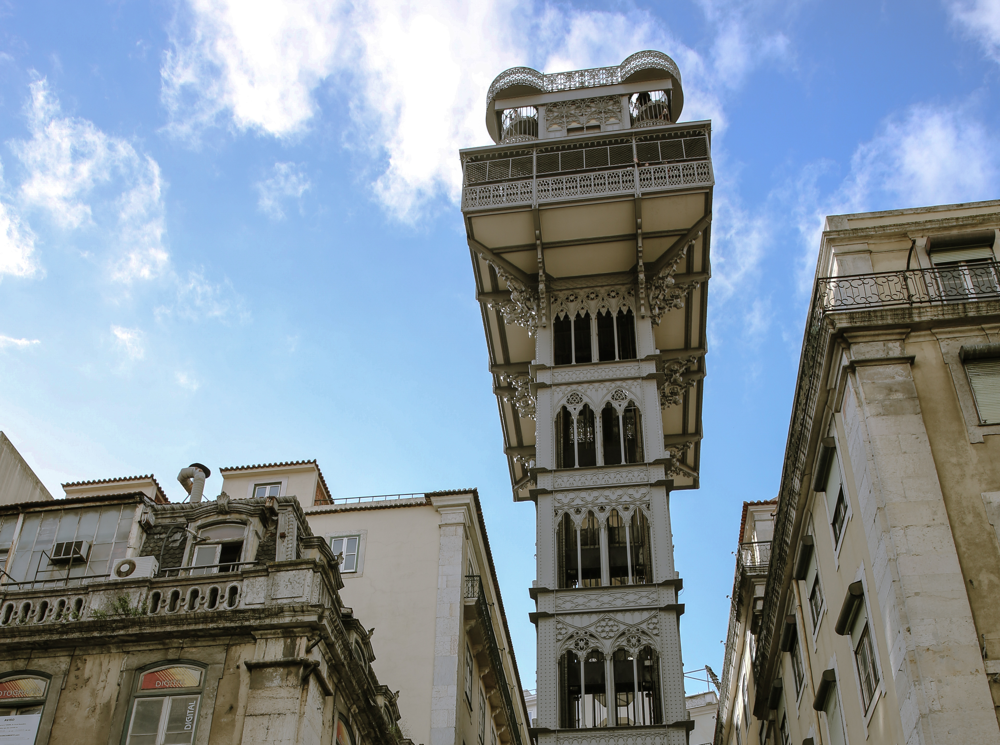

Lisbon is a beautiful European town to visit during the winter months. While the rest of Europe is experiencing the wintery cold and snow, Lisbon weather is sunny, breezy, and just perfect for exploring. 

 

##
**What to See & Do**

#### **Placa do Commercio**

 

#### **Elevador Santa Justa**

 

#### **Alfama District**

 

#### **Jeronimos Monestery**

 

#### **Belem Tower**

 

#### **Convento do Carmo**

 

#### **Miradouro Santa Luzia**

 

####**Monument of Discoveries**

 

####**Rossio Square**

 

#### **Time Out Market**

 

##
**Day Trip to Sintra**

####**How to Get There**

#### **Places to Visit: Pena Palace, Quinta de Regalaira, Town Center**

 
 
 
 

##
**Where I Stayed**

I stayed in an apartment right on the famous Pink Street. While this meant I had to hear faint discotech music on the fifth floor, I really felt like I was living in 