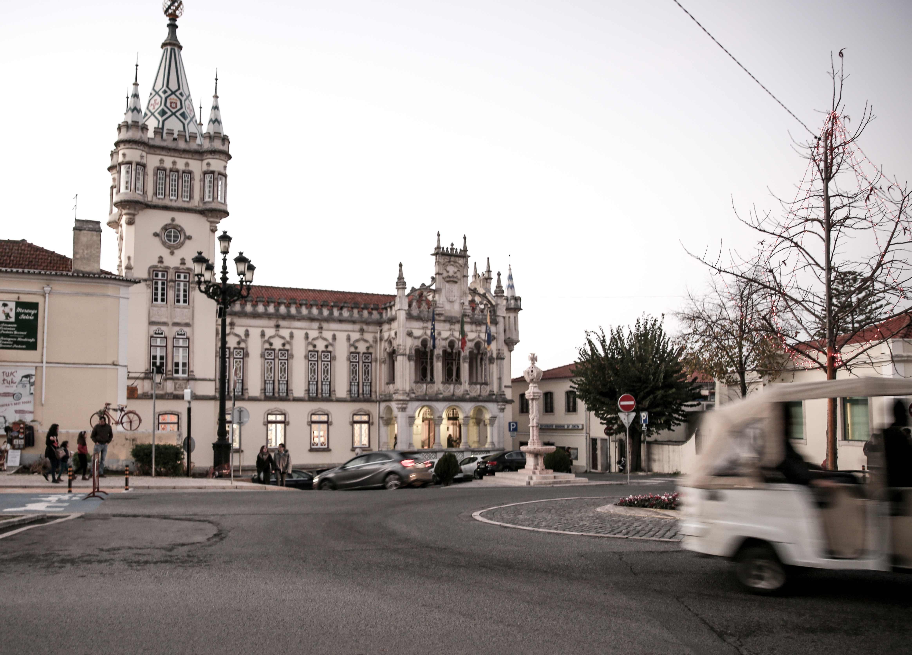

Spending a day in Sintra with its romantic architecture is different from the city of Lisbon. The historic palaces and gardens are all considered UNESCO heritage sites and used to be where the Portuguese royals stayed at. The city itself is considered an expensive city to live in and has been consistently ranked one of the best places to live in Portugal. If you're looking for high-end hotels and dining, Sintra is the place to visit. 

**Read More|** [Weekend Trip to Gorgeous Lisbon](https://www.wheretonextdoc.com/blog/weekend-trip-to-gorgeous-lisbon)

&nbsp;

*****************************
####**How to Get There** 

We personally found an Uber or a taxi to be really convenient to reaching Sintra. With four people, the cost of 20 euros was one way was affordable, and we were dropped right at the doorstep of Quinta de Regalaira in 15 minutes without having to worry about the hassle of parking. 

On the way back, we decided to take the train. The other easiest way to travel between Sintra and Lisbon is to take the train from **Rossio Station** in the center of Lisbon. Trains leave every 30 minutes. The trip takes around **40 minutes**, and the roundtrip ticket is approximately **5 euros per person**. 

&nbsp;

******************************
#### **How to Get Around Sintra** 

 

The 434 Bus is a great affordable option that stops at most of the important sights to visit in Sintra.

Otherwise, there are many tuk tuks and taxis everywhere ready to pick up people. Just expect the price of using these more luxurious methods of traveling to be a lot more expensive. To get from Quinta de Regalaira to the entrance to the Pena Palace gardens was 20 euros! This price was standard to get between any of the Sintra sites and did not vary between car or tuk tuk. 

&nbsp;

*******************************

### **What to See & Do**

There is so much to do in Sintra, but if you want to see the palaces properly, I recommend picking three places to visit in a day. All the palaces close by 5 PM 

#### **Quinta de Ragalaira**

The gardens of Quinta de Regalaira is unparalleled by any of the other gardens in Sintra. This beautiful site opens earlier than the other sites in Sintra, and visiting it first in the day means avoiding a lot of other people with tours that visit Pena Palace first. Expect to spend around an hour and half wandering through the gardens itself. 

Tickets & Times

```grid|2|
 

 
```
The gardens have several spots to visit, so be sure to grap a map when you buy tickets. My favorite spots were the Initiation Well 

 

Walking through the palace took about 5 minutes, but it's not as impressive as some of the other palaces in the area. Be sure to take advantage of the restrooms and small cafe for any refreshments before heading to Pena Palace.

&nbsp;
&nbsp;

#### **Pena Palace**

The walk through the gardens takes about 20-30 minutes to reach the top where the Palace sits. Our ticket was for exploring the grounds only but not to enter the palace. 

```grid|2|
 

 
```

 


&nbsp;
&nbsp;

##### **Other Places to Visit:** Montserrate Palace, Moorish Palace, National Palace of Sintra 


#### **Town Center**

Ending the day in the center of Sintra was 

 

Walking from the National Palace of Sintra to the train station took about 15 minutes. 

