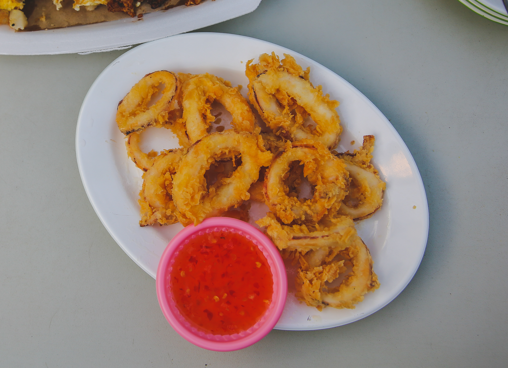
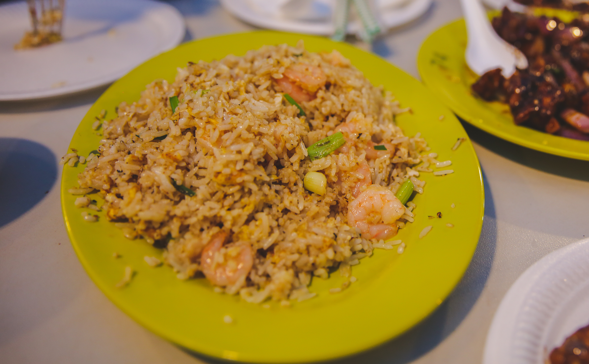
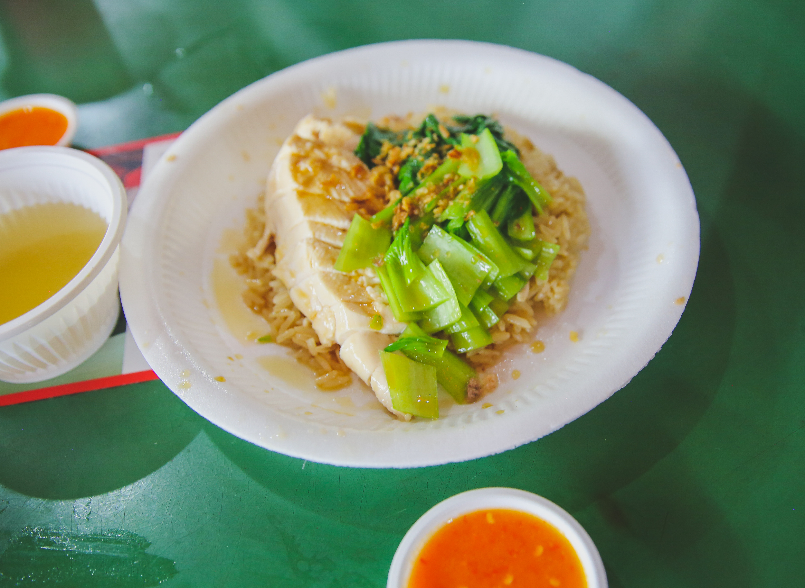
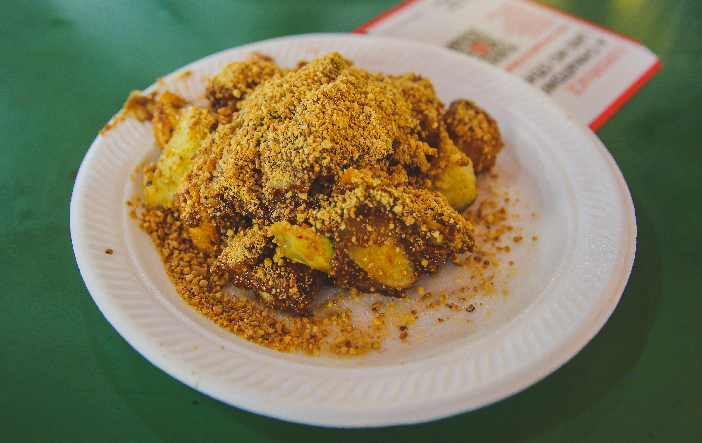

During my trip to Asia visiting Bangkok and Singapore, I got to try all kinds of new, uniquely prepared food that I have never come across living in America. I couldn't find many of the common Thai dishes I normally order to-go at my local Thai restaurant, so it was a bit of an adventure to try completely new and authentic dishes while in both of these Asian countries. 

&nbsp;

**********************

### **SINGAPORE**

&nbsp;

**NEWTON HAWKER CENTRE.** The hawker center that the characters in Crazy Rich Asians visit on their first day in Singapore was the Newton Hawker Centre. In a similar fashion, we arrived around 6 PM on our first day after refreshing in our hotel from the airport. There were still many open tables to pick from so we didn't need to use our napkin pack to reserve one, but its always a good idea to keep one on you in case. If you do come across a table with napkins on it, it means someone has already taken the table and will be returning soon. Before ordering, I recommend walking around to see what all they sell. The stalls each specialize in a few dishes and make them really well. A few of the stalls even have Michelin stars. Some of the dishes we tried were the black and white carrot cake, shrimp fried rice, BBQ stingray, chicken skewers, and calamari. 


```grid|2|
 
 
```

At the entrance of the Newton Hawker Centre, there is a board with all the classic drinks and desserts to try while there. Try getting some while at Newton. We tried the famous Singaporean dessert called chendol, a iced sweet with red beans, coconut milk, green flour jelly, and palm sugar syrup. It was interesting to look at but actually tasty to eat! 

**MAXWELL HAWKER CENTRE.** Located right across from the Buddha Tooth Relic Temple, the Maxwell Hawker Centre is well known for its Hainanese chicken. For the vegetarians out there, there are still dishes to try at Maxwell! We tried a dish called rojak, a spicy vegetable salad covered in tamarind paste, that I actually really enjoyed eating. Since we arrived around 7 pm, some of the stalls had already closed, but there was still hustle and bustle of people standing in long lines for the Hainanese chicken. While at Maxwell, I tried bandung, a bright pink rose flavored sugary drink, and sugarcane juice. 



**TEKKA HAWKER CENTRE.** For lunch on my second day, we ended up at the Tekka Hawker Centre, which sells a lot more Indian food. During lunch time, there were many open tables. This hawker centre is definitely very busy with lots of yummy smells wafting through the entire place. We tried the chicken and shrimp biryani which were excellent. Oh, the naans were to die for as well. As an Indian American, I eat a lot of Indian food, but this was by far some of the best I've tried. I also tried the hot teh tarik despite the sticky weather outside, which was decent but not my favorite drink in Singapore. That title easily goes to the boba tea fron CHICHA San Chen. Even though the food stalls don't provide napkins, there are sinks scattered throughout the centre to wash your hands after eating. 

```grid|2|
 
 
```

Other great places to try food while in Singapore is at Haji Lane, China Town, Clarke Quay, Old Airport Hawker Center, and inside 313@Somerset Mall.

&nbsp;
&nbsp;

*************************

### **BANGKOK**

&nbsp;
I probably didn't take full advantage of the Bangkok food scene as I should have during my three day trip there. However, I did try some crazy good food that I'd like to share with you all. 

**KHAOSAN ROAD.** The pad thai I got on Khaosan Road cost only 40 baht (about a $1.50), made in 5 minutes right in front of us, but it was some of the best noodles I had all trip. Taste = Priceless.

```grid|2|
 
 
```

**TALING CHAN FLOATING MARKET.** At the Taling Chan floating market, there were several stalls selling different street food to locals living nearby. There were several tourists scattered here and there, but not as many as we expected. We tried the coconut pancakes, takoyaki, and chicken satay. However, the fish dishes here are the specialty to look for if you enjoy seafood.

**NEAR WAT PHO.** When we got off the boat near Wat Pho, we saw a stall selling grilled crocodile meat. We were not adventurous enough to try it but some of the people eating it looked like they were really enjoying the meat.

 

**ICONSIAM.** Even though its not technically street food, the bottom floor of the mall has several local food vendors selling the classic street food indoors. It's quite easy to get overwhelmed in here. For dinner on our last night, we went to a nice restaurant inside ICONSIAM selling Thai street food. The sukhothai noodle soup was just what the (future) doctor ordered. Literally. The dish was comforting and super delicious after a long day of exploring. 

```grid|2|
 
 
```
**CHATUCHAK WEEKEND MARKET.** I tried to get mango sticky rice and coconut ice cream as often as I could while in Bangkok. Whenever I got coconut ice cream by itself, it was always served inside a scooped out coconut shell instead of a plastic cup, which is awesome! However, the mango sticky rice was the best desert by far, and I enjoyed the one I got inside Chatuchak Weekend Market most of all.

&nbsp;

********
That's all I've got for a delicious and interesting food experience while visiting Bangkok and Singapore for the first time. The next time I return, I'm definitely gonna challenge myself to be more adventurous in trying some of the dishes I shyed away from this trip.