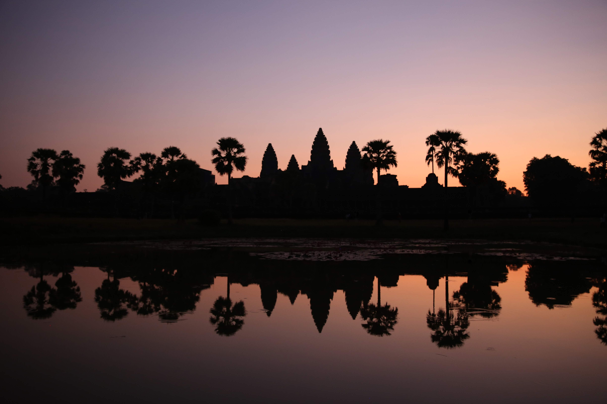

As much as I can try to describe the feeling of being at Angkor Wat, climbing the old stones, and standing in musty long corridors, picutres are still worth a thousand words. So, I'll let the pictures speak for themselves. The camera we used to shoot these photograpghs is the Canon 5D. For more information about how to plan your trip to Angkor Wat, please read my other article!

**Read|** [Exploring Angkor Wat, Siem Reap: Two Day Itinerary]("https://www.wheretonextdoc.com/blog/exploring-angkor-wat")


```grid|2|
 
 
```


```grid|2|
 
 
```


```grid|2|
 
 
```


```grid|2|
 
 
```


```grid|2|
 
 
```


```grid|2|
 
 
```


```grid|2|
 
 
```


```grid|2|
 
 
```


```grid|2|
 
 
```


Hopefully, you are able to appreciate the beauty of Angkor Wat from these images, but they are nothing compared to being there in person. If I have somehow inspired you to visit Cambodia or have reaffirmed your decision to go, I hope to help your travel plans be exciting and more efficient!

