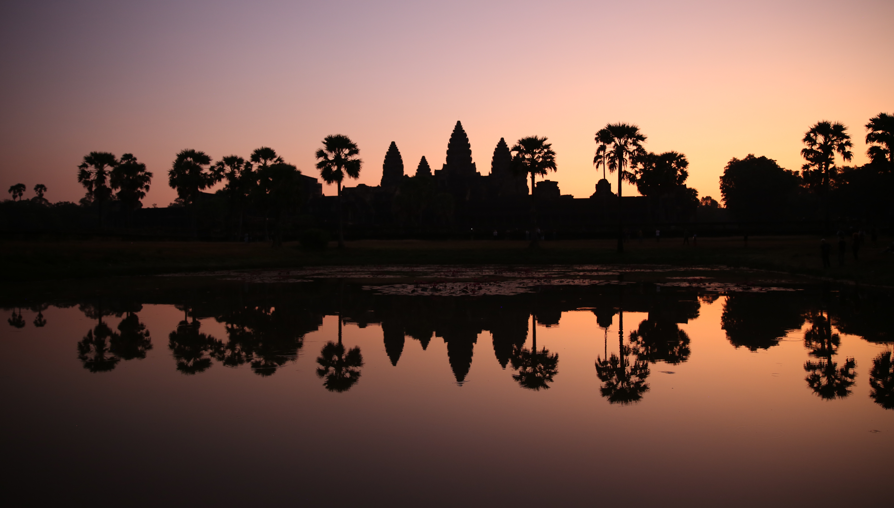
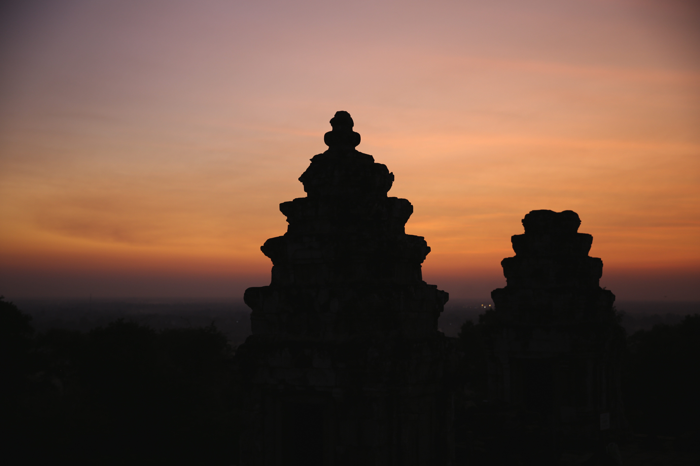

If you're looking for history, ruins, and the feeling that you are an archeologist in the 20th century, then definitely consider coming to Siem Reap to visit Angkor Wat. The mysterious morning mist, the overgrown trees taking over the ancient stones, and that one special moment when you find a spot in the temple with no other visitors; it all makes it worth visiting Angkor Wat. Most of the temples were built in the 12th century under the rule of King Jayavarman, but you will also find several temples that are dated even older. There are obvious Hindu influences in the early temples with many depictions of gods such as Vishnu, Shiva, Rama and classical stories from the Ramayana and Mahabharat. Later temples are more Buddhist influenced with different architecture involving faces. 

**Read|** [Photo Tour of Angkor Wat and More](https://www.wheretonextdoc.com/blog/photo-tour-angkor-wat)

The best time to visit is **November to early April** when the temperatures are not soaring high. Even visiting around Christmas time, the temperatures would reach 91 degrees Farenheit by noon, so planning your day is critical to avoid the heat from sapping your energy. Despite the heat, it is important to keep in mind the dress code while visiting the temples - **all shoulders and knees must be covered for both men and women**. 

&nbsp;

***********
### **Tickets**

If you landed the afternoon before your two full days, then pick up your tickets before 5 PM in order to avoid the hassle of getting tickets early in the morning before sunrise. The ticketing office is only 15 minutes away from Siem Reap city center. If you have to pick up tickets in the morning before sunrise, then plan to be at the office by 5 AM when it opens. Otherwise, you might find yourself spending the sunrise at the office or with a bad view of the temple. 

There are three options for tickets: 1 day, 3 day, and 7 day passes. You can pay with cash or card. Online booking of tickets is not available. 

&nbsp;

************
### **Transportation**

The most popular way to see Angkor Wat is by **tuk tuk**. You can talk to your hotel manager to set up a tuk tuk for an entire day to take you anywhere inside the complex as needed or you can try to negotiate by yourself. The prices were consistently quoted around $60 for an entire day. Negotiating a tuk tuk on your own can be difficult if the driver decides to charge you more in the morning for the sunrise when you aren't able to find any one else to take you. 

The other way to see Angkor Wat is to have a driver with a **4WD car** that can also be arranged through the hotel, which was quoted at $80/day with additional $15 to see Banteay Srei. Booking on your own or through the hotel generally did not seem to make a huge difference in cost.   

Most drivers will ask for cash. Interestingly, Cambodians **prefer Riel or even USD** for payment. However, if you choose to pay in USD, they only accept bills without any tears, ink marks, or too many creases. This was true at most places that required cash. Within the city, you can use the app **Grab**, which is similar to Uber, if you prefer to pay with card. 

&nbsp;

**********
### **Temples: Day 1**  

Today is the longer day of the two in order to cover the small circuit of Angkor Wat and see a few additional temples. Plan to wake up around 4 AM to prepare to reach the ticket office by 5 AM. Important things to pack include handkerchief, water bottles, battery powered hand fan, and hat to fend off the heat. 

If you are interested in learning about Angkor Wat, finding a tour guide at the entrance of each of the temples is easy. The ticket checkers might ask you or guides might offer you their services themselves. If you are not interested in a guide, there is an app, **Angkor Wat Smart Guide**, that can be used even without data to explain the history behind each of the temples. 

Other temples and structures we visited this day include Thommanon, Terrace of the Elephants, and the Khleangs.

##### **Angkor Wat for Sunrise**

As I walked with hundreds of other people across the moat in total darkness, I felt excited. As I found my place in front of the pond, I could barely make out the outline of the temple in front of me. The moon was just a sliver in the sky, giving off enough light to not trip over anything but otherwise not giving away anything until sunrise. By 5:30 AM, the place was packed with a small crowd around the pond. As the sky began to change colors, the number of clicks of photography also began to increase. Just drown them out, this is an incredible moment that we are all sharing together. From purple to pink to orange and finally, the sun peeks through. The temple finally appears in all its ancient, mysterious glory. I can see the pink lotuses blooming in the water in front of me. The early morning was completely worth it. 

After roaming the outer grounds of Angkor Wat in awe until 7 AM, I decided to leave instead of entering Angkor Wat to make my way to the next famous temple. While the hordes that were standing with us entered Angkor Wat, we were going to try to get ahead of the crowd by heading to Bayon temple next.  

##### **Bayon Temple**

As we drove from Angkor Wat, we pass through the Southern Gate into Angkor Thom. The path leading up to the gate is lined by demons on one side and gods on the other side gripping a snake which makes up the banister, a common feature seen at many of the temples. 

Within 15 minutes from Angkor Wat, we arrived at Bayon temple with a few minutes to spare. The temple opens at 7:30 AM, and by 7:25 there were already 15 of us waiting to be let in. Visiting Bayon Temple at this time is simply magical with the morning sunlight coming through the mist and temperatures still bearable enough to not be soaking wet just yet. The first thought I had walking in was just how many smiling stone faces are at Bayon Temple? The answer to that is 50 in total according to our driver, Yuri. 

Nearby Bayon Temple is **Baphuon Temple** which was originally a temple dedicated to Shiva before being converted to a Buddhist temple in the 15th century. Towards the back of the temple, you may recognize the wall in the shape of a reclining Buddha! 

##### **Ta Prohm** 

The famous temple featured in the movie, Lara Croft. Due to its on screen appearance, this temple sees many more tourists than some of the other temples. The archeologists left the large cotton silk trees growing into the temple walls to give visitors an idea of the wildness the temples were originally found in. While it is an awesome temple to visit, there were definitely more cooler temples to visit with the cotton silk trees and less visitors.  

##### **Banteay Srei**

Banteay Srei is actually a very old temple compared to Angkor Wat, and the decorative detail of the distinctive red sandstone is exquisite. For this reason, the temple is considered a "lady temple".   

The temple is about a 30-40 minute ride from the main complex of Angkor Wat, so its a great time to catch a little nap. This temple is included in the ticket for Angkor Wat.

##### **Phnom Bakheng**

The most popular place to watch the sunset is at Phnom Bakheng which sits on top of a hill. There is an unobstructed view of the forest below and even a chance to glimpse Angkor Wat from above. However, to actually watch the sunset at Phnom Bakheng requires some planning and patience. Only 300 people are allowed at the top of Phnom Bakheng for safety reasons. Usually by 4 PM, all of the spots to watch the sunset are probably taken. When we reached the top of the hill, it was 4:40 with a large line of people hoping to get in before the sunset at 5:20. By the time we were let in, the sunset had already happened, but the colors of the sky were still phenomenal. Easily rivaled the amazing sunrise we had seen early in the day. By the time we came down, the darkness was settling in with just barely enough light to walk down the hill. 

&nbsp;

************
#### **Temples: Day 2**

Day 2 will be a shorter day with this itinerary. We were done with temples by noon in order to escape the heat. The temples we covered on the second day were on the Big Circuit. The benefit of the Big Circuit is that there are way fewer tourists since most people only get the one day pass to cover the main temples in the Small Circuit and the temples are actually much cooler, with the exception of Angkor Wat and Bayon. 

Other only other place we visited today was Neak Pean. 

##### **Inside Angkor Wat** 

Though the exterior of Angkor Wat is so beautiful at sunrise, the interior is stunning in the early morning light. The main center of the temple is surrounded by long corridors with murals depicting various scenes from the Hindu tales. On certain days, they even allow you to climb into the central tower area. There is a lot of ground to cover so plan to spend about 2 hours here. 

##### **Preah Khan** 

My favorite temple by far! Since Ta Prohm is the temple dedicated to the mother, then Preah Khan is kind of like its sister temple dedicated to the father. The temple was essentially long corridors extending in all four directions with photo frame like doorways, so I could see all the way through the temple standing at the entrance to the exit. When you find yourself at the exit depending on how you came, there is a large cotton silk tree roots clinging to the temple. 

I suggest visiting Preah Khan over Ta Prohm if you have limited time to visit Angkor Wat. There were less visitors, and the overgrown tree was much more impressive to see. It's easiest to visit Preah Khan from Bayon Temple; you will pass through the Northern gate which is similar to the famous Victory gate and South gate. However, I also liked the Northern Gate more than the others since there was less traffic passing through and more forest greenery all around. 

##### **Ta Som**

Our last temple we visited in Siem Reap. There are a few more smiling faces here similar to Bayon Temple as well as a tree growing into the doorway towards the end of the temple. We didn't see many monkeys in Cambodia, but there was one at Ta Som trying to be cute for some food. I advise against giving any food and be careful if you are eating some of the mango and pineapples that are sold at every temple. 

&nbsp;

****************
### **Other Things to Do in Siem Reap**

There are several other things to do in Siem Reap if you feel "templed out." The best place to get food of all types of cuisine is on **Pub Street**, which is a lively place to be at night. We had dinner at Elia, a Greek restaurant, that was incredibly good. If you finished temples by noon and have a bit of energy to do something new, try taking a **pottery class**. They require advanced booking one or two days prior to have all the materials for you. Finally, if you're tired from the exploring and the heat, then there are several **spas** throughout the city for massages at affordable prices. 

If you are not "templed out," then there is another temple called **Beng Mealea** which is about an 1.5 hr drive from Siem Reap that most tourists do not head out to see. It is largely unrestored and more rugged and wild to visit. This temple is not included in the pass for Angkor Wat and would require a separate ticket.

&nbsp;

***********************
Our trip to Siem Reap was amazing, and we finally got to fulfill our wish to explore the ruins of Angkor Wat. It may be hot, dusty, and busy, but the temples are beyond amazing and completely worth the time and effort to visit. 