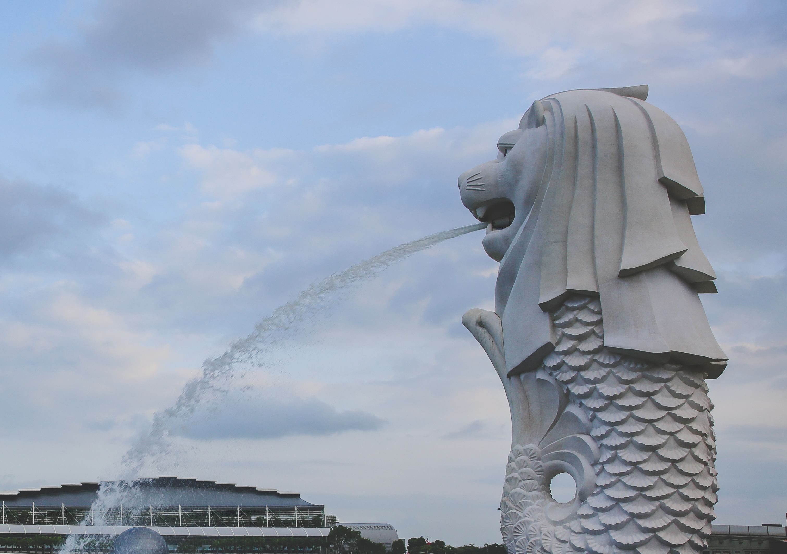

Singapore is an interesting city-state found on the tip of the Malaysian peninsula. The mix of Chinese, Indian, Malay, and Arab cultures gives Singapore a unique neighborhoods to explore. The people definitely have lion pride for their city which is sleek, modern, and best of all, environment friendly driven. Here's the top 10 things I did in Singapore in three days!

************

### **Explore Changi Airport, the best airport in the world**


Be sure to set aside time to walk around Changi Airport when you land or before departing to experience the features that make this the best airport in the world. The newly opened Jewel Changi Airport is a waterfall in Terminal 2, and there's clear signage everywhere to get to it. The seats at the bottom of the waterfall requires tickets, but there are great free viewpoints on every floor. 

There are lots of other things to enjoy such as art installations, orchid gardens, gardens with butterflies, free movie theater, the tallest airport slide, and more. Download the Changi Airport app to help locate these really cool features. 

### **Feel extravagant at Marina Bay Sands** 

Marina Sands Bay is one of the most luxurious hotels I have ever stepped into. I immediately felt like I had been transported into a much more upscaled version of Las Vegas with classiness and opulence oozing everywhere. The best way to experience the hotel is to stay there. However, if its not in the budget, then going up to the top floor for a birds eye view of Singapore for a drink is a great way to experience the grandness of Marina Sands Bay without breaking the bank. 


In front of the hotel is a high end mall and fancy restaurants to spend an evening exploring. There is a fun installation at the entrance of the mall near the waterfront where you can talk to someone standing on the opposite side by just leaning down and speaking at the edge. We were entertained by this for a good 20 minutes after figuring out what it did. At certain times in the evening, there is a light show in the bay that lasts about 20 minutes. Just a 10 minute walk away from the mall's waterfront is the **Helix Bridge** with views of the bay and the **ArtScience Museum**. 

 

### **Enjoy nature in a modern way at Gardens By the Bay**

There are a quite of few things to do at the Gardens by the Bay to keep you occupied for a whole day. I suggest wearing comfortable walking shoes when visiting because there is a lot of back and forth walking required to see the gardens and the two domes. Buying tickets the day before for the super popular domes and the sky walk made our day a little bit more manageable. 

CLOUD FOREST. This impressive manmade cloud forest is definitely worth seeing. The variety of plants and flowers carefully placed among one another to imitate a natural cloud forest is amazing and shows how dedicated Singaporeans are to their plants. Every hour, the mist is turned on for a few minutes to water the plants. 


The message that is impressed upon all visitors after enjoying the forest is the effect of humans on the climate. That natural cloud forests are disappearing and the ecosystem they support are suffering. The short movie at the end of the path through the dome was difficult to ignore and made me reflect about my own energy usage and recycling habits. There is always a way to do better. 

FLOWER DOME. The Flower dome hosts flora from different countries as the largest glass greenhouse in the world. It's a celebration of the variety of plants found all around the world, and its awesome to see that they are able to grow so many plants under one common roof. 

OCBC SKYWAY. Walking the skyway gives you the chance to observe the Super Grove up close. Each tree has been designed to function like an actual tree with photovoltaic cells to capture solar energy and even collect the moisture in the air to be used in various ways in the garden. It's so awesome to see designs such as the Super Grove that work hand in hand with nature instead of tearing it all down.   

```grid|2|
 
 
```

LIGHT SHOW. The best is saved for last and is also completely free. I recommend finding a spot to watch the show about an hour before it starts for great seats in the middle with a view of all the trees, but honestly, all the spots are great to watch the show. We found an empty spot under one of the outskirt trees and laid down looking up for the whole show. After a long hot day of walking around, enjoying the cool night breeze watching the colors change across the Super Grove trees was a stunning way to end the day. 


### **See the Singapore mascot at Merlion Park**

Granted there's not much to do here other than see the Merlion statue up close and get a different view of the bay, it was still hilarious to see people posing with their mouths open pretending to drink the water spouting out from the lion's mouth. The merlion is the symbol of Singapore because the lower half portrays the city's beginnings as a fishing village and the upper half portrays the lion in the name Singapore. 



### **Shop until you drop at Orchard Lane** 

I normally don't visit malls in different countries but in Asia and especially in Singapore, it's a must! I think we went to the Orchard mall about 5 times during the three days we were in Singapore since our hotel was right next to it. Since it was Christmas time, the streets were lined with bright LED Christmas trees to bring the holiday cheer. Inside, we spent time shopping at Uniqlo, Cotton On, H&M, Forever 21, and more. As it gets later in the evening, the crowds just get bigger. I think everything was still open with lots of people at 11 pm! 

Across the street from the hotel is the **Emerald Hill lane** which has bright colored houses in the classic Peranakan style of Singapore. During the day, none of the stores and restaurants were open, but seemed to come to life in the evening as the streets became more busy.  


Be sure to visit the interesting **Orchard Library** with its wavy bookshelves. I had to use all of my willpower to not get caught up in the next James Patterson novel and join the many others quietly enjoying a book. 

The best bubble tea place I've ever had was called **CHICHA San Chen** on the second floor of 313@Somerset. If you love tea with boba, you have to try this place. I noticed everyone walking around drinking it and finally decided to try some myself on my last day in Singapore. I had to wait almost 30 minutes in line to get it; it was that popular. There's also a wonderful breakfast place called **Ya Kun** to try the standard Singaporean breakfast of kaya toast and eggs. 

### **Spend the evening in China Town**

As we got off the bus in China Town, the street lights were just starting to turn on. We decided to visit the **Buddha Tooth Relic Temple** before strolling through the streets of China Town. The interior of the temple was grand with hundreds of figurines decorating the walls and shrines dedicated to different gods. As we exited the temple, the restaurants were starting to put out chairs for dinner time. Despite how tempting the smells were, we decided to head to the **Maxwell Food Center** for the famous Hainanese chicken across the street for dinner. 

```grid|2|
 
 
```


For an interesting Insta pic, visit the **Peoples Park Complex** nearby if you have some more time in this area!

### **Walk Haji Lane in Kampong Glam**

The street is lined with small unique boutiques and souvenir shops as well as eclectic bars and restaurants to spend some time. The walls are covered in colorful street art. Right next to this street is the Sultan mosque.


### **Visit colorful Little India** 

Tan Teng Niah's House is a popular destination in Little India with its bright colored walls making for a great backdrop for some photos. Around the area are more places to sit down and grab some spicy Indian food. 

> Best way to travel in Singapore is using the metro and bus. Be sure to buy the official Singapore Tourist Pass, only sold in certain stations, for the best prices on public transportation and discounts on tickets to popular attractions. 


### **Eat Your Heart Out at Hawker Centres**

We went to three hawker centers to try the famous street food with Michelin stars and more. It was an experience to say the least! If you're in Singapore, you better be geared up to try all sorts of interesting food with an open mind. It's important to take a box of tissues or wipes to use as placeholder to reserve a table. If you see a table with tissues on it, it means its taken. The hawker centers are also pretty stingy with giving napkins to use so having your own is the best way to keep things clean. 

**Read|** [Street Food Diary of Bangkok and Singapore!]("https://www.wheretonextdoc.com//blog/food-diary-of-bangkok-and-singapore")


### **Take pictures at the Old Hill Street Police Station**

This police station has over 900 windows all painted in different colors of the rainbow! It's a fun place to take some photos to add color to your Instagram!


